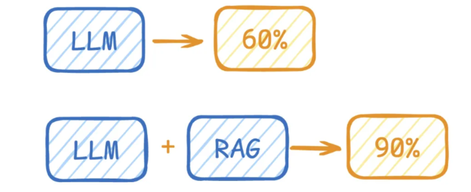
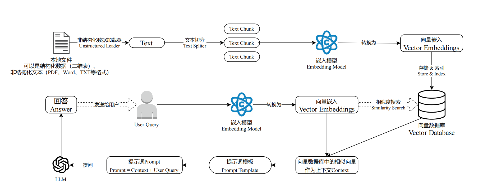
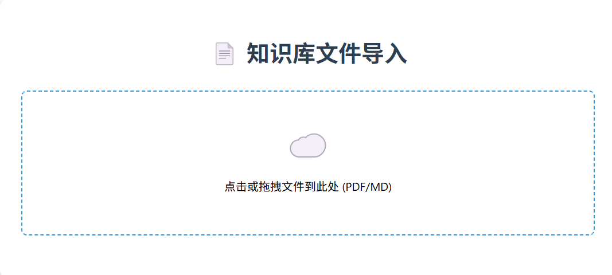
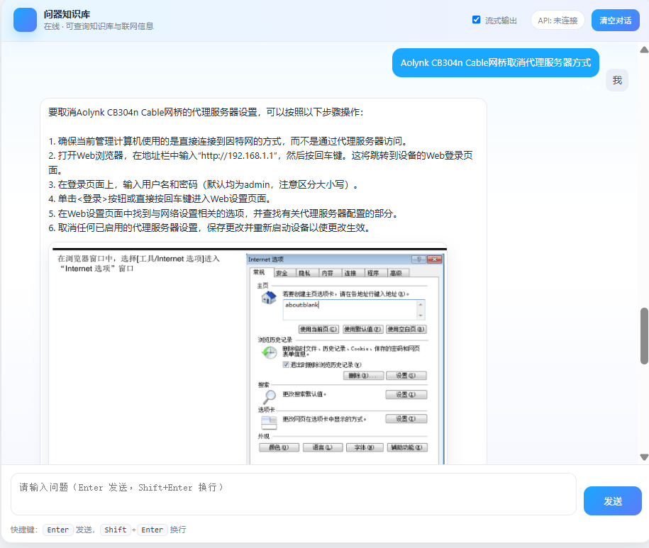
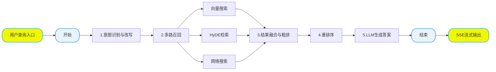
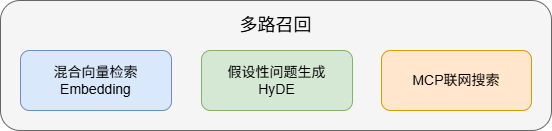
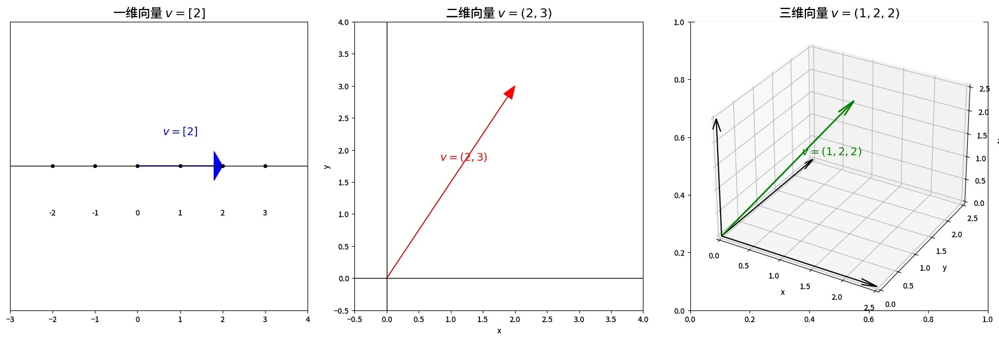
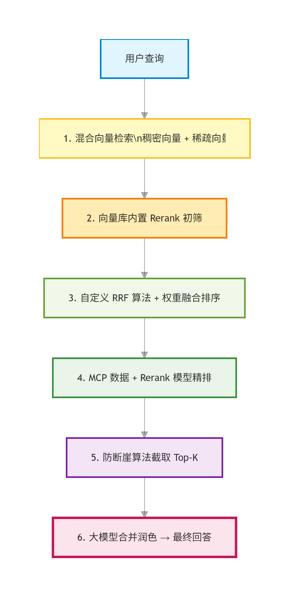

# 掌柜智库 RAG 项目介绍

### 1. 前置：RAG 技术简介

#### 1.1 什么是 RAG?

RAG（Retrieval-Augmented Generation）检索增强生成，是当前大模型企业级应用的主流架构。

传统大模型仅依靠训练知识回答问题，在陌生领域、私有业务、实时信息等场景下容易出现事实幻觉、答案不准确、引用不可靠等问题。RAG 通过 **“先检索、再生成”**的方式，让大模型在回答前先从外部知识库中查找相关事实材料，再基于真实资料生成答案，从根源上提升回答的准确性、可信度与可追溯性 。



> **2026 年：1M（百万 token）成旗舰标配，128K 是主流门槛**。
>
> **1M token ≈ 75 万汉字**：可一次性处理整本书、全套技术文档、完整代码库。
>
> **国产三强**：DeepSeek V4、Qwen3、GLM-5 全部进入长文本第一梯队。

#### 1.2 RAG核心价值

- 降低大模型幻觉，保证答案基于事实
- 无需重新训练大模型，低成本接入私有知识
- 支持实时更新知识库，信息更及时
- 实现数据安全可控，适合企业内部场景

#### 1.3 RAG 核心流程

**数据准备**：将原始文档进行切片处理、向量化编码，最终存入向量数据库，完成知识库的构建与初始化，为后续检索提供数据支撑。

**用户检索**：接收用户查询后，先对问题进行意图理解与向量化，再从知识库中召回最相关的知识片段，最后将检索到的内容作为上下文，输入大模型生成精准、可信的最终回答。



**RAG 中的关键模型应用**

*   **Embedding (向量化)**：使用 `Embedding 模型`将文本转化为向量 (支持稠密和稀疏向量)，用于后续的相似度检索。
*   **Rerank (重排序)**：使用 `Rerank 模型`对初步召回的切片 (如 Top 50) 进行精细排序，过滤无关信息，提升上下文的相关性。
*   **LLM (生成)**：使用`大语言模型`基于检索到的上下文和用户问题生成最终答案。

### 2. 掌柜智库项目 (RAG)介绍

#### 2.1 项目背景与价值

在企业内部知识管理、智能客服、专业咨询等场景中，直接使用大语言模型容易出现事实性幻觉、领域知识不准确、涉密信息不可控等问题。检索增强生成（RAG）通过外挂私有知识库，让大模型基于事实生成、依据文档回答，是目前企业级 AI 应用最稳定、最落地的技术方案。

 **掌柜智库** 正是基于 RAG 构建的**企业级私有知识库智能问答系统**，面向真实业务提供高可信、可追溯、可运维的智能问答能力，整体工程化代码规模 **5500+ 行**，具备完整生产级可用度。

核心定位: 掌柜智库是一套**全链路、高鲁棒性、可扩展**的企业级智能问答系统

- 支持私有知识安全管理与私有化部署
- 实现高精准问答，显著降低模型幻觉
- 支持多格式文档自动解析与结构化入库
- 融合多路检索、混合向量、重排序、联网补充等高级策略
- 最终为企业提供**稳定、可信、可解释**的智能问答服务

#### 2.2 项目流程梳理 

整个系统分为 **两大核心流水线**，逻辑非常清晰：

1. **知识库构建流水线（准备）**：原始文档 → 结构化解析 → 语义切片 → 元数据提取 → 混合向量生成 → 向量数据库存储

   

   ```mermaid
   flowchart LR
       A[START]
       B[1.任务分发]
       C[2.PDF结构化解析]
       D[3.多模态图片理解]
       E[4.智能文档切片]
       F[5.主体识别与标签提取]
       G[6.混合向量化]
       H[7.数据持久化]
       I[END]
       
       A-->B
       B-->|PDF|C
       B-->|Markdown|D
       C-->D
       D-->E
       E-->F
       F-->G
       G-->H
       H-->I
       
       %% 核心样式设置：圆角 + 配色区分
       style A fill:#e8f4f8,stroke:#4299e1,stroke-width:2px,rx:20,ry:20
       style I fill:#f0f8fb,stroke:#38b2ac,stroke-width:2px,rx:20,ry:20
   ```

2. **智能检索系统 (查询)**：用户提问 → 意图理解 → 多路召回 → 结果融合 → 重排序 → LLM 生成答案 → SSE 流式输出

   



#### 2.3 项目核心技术栈

本 RAG 项目以**LangGraph**为工作流核心，围绕 LangChain 生态打通 “大模型调用 - 文档解析 - 向量计算 - 向量存储 - 检索生成” 全链路；依托 PyTorch+FlagEmbedding 实现高效向量建模，基于 Milvus+MinIO 完成向量与文件的存储管理，通过 uv、loguru、python-dotenv 等工具保障工程化落地，最终构建出适配 “掌柜智库” 场景的高性能、可扩展 RAG 应用体系。

**核心框架与工作流编排**

**LangGraph**: 作为 LangChain 生态的工作流编排核心框架，是本项目的核心技术支柱。用于搭建大模型应用的任务流程编排，支持定义多步骤任务的执行顺序、分支逻辑、状态管理，适配 RAG 场景下复杂的知识图谱构建、文档处理流程的落地实现。

**LangChain 生态**

- langchain：大模型应用开发核心框架，封装了大模型调用、提示词管理、工具链整合、数据处理等通用能力，是连接业务代码与大模型的核心中间层。
- langchain_openai：LangChain 对 OpenAI 系列模型的专属封装，兼容 OpenAI / 国产大模型（千问 / 即梦 AI 等）的 OpenAI 风格 API，简化大模型客户端初始化与调用。
- langchain_community：LangChain 社区扩展库，补充丰富的第三方工具、数据源、模型适配能力，完善 RAG 场景的生态覆盖。

**模型与向量计算**

- PyTorch（torch）：核心深度学习框架，为向量模型（BGE-M3）提供运行环境，支撑模型加载、推理、张量计算；支持 CUDA 加速（适配 cu124 等版本），可调用 NVIDIA GPU 提升向量计算效率，无 GPU 时自动降级为 CPU 运行。

**嵌入（Embedding）模型**

- FlagEmbedding：智源研究院开源的嵌入模型工具库，封装 BGE-M3 等优秀向量模型，实现文本 / 图片的向量化转换，是 RAG 场景下向量检索的核心依赖。
- modelscope：魔搭社区开源模型工具库，补充丰富的开源模型资源，适配多类模型的加载与调用。

 **PDF 智能解析**

- MinerU：智能 PDF 解析库，解决传统 PDF 解析的格式错乱、图片 / 表格 / 公式提取失败等问题，精准提取 PDF 内容并保留排版，输出 Markdown/HTML 等易处理格式，是 RAG 文档预处理的核心工具。

**向量数据库**

- pymilvus + pymilvus-model：Milvus 向量数据库 Python 客户端，pymilvus 负责向量的增删改查、数据库连接操作；pymilvus-model（2.4.0 + 版本拆分独立包）封装嵌入函数、混合检索等能力，是向量存储与检索的核心组件。

**其他内容存储**

- minio：MinIO 对象存储 Python SDK，实现 PDF / 图片 / 文档等文件的上传、下载、删除、桶管理，适配分布式文件存储场景。
- MongoDB + pymongo: 用于存储**文档元数据、解析结果、切片内容、任务记录、用户对话历史、日志**等结构化 / 半结构化数据，是 RAG 系统不可或缺的持久化核心。

**环境与依赖管理**

- uv：新一代 Python 虚拟环境与依赖管理工具，替代传统 venv/pip，实现跨环境依赖一致性，通过 pyproject.toml 统一管理项目 Python 版本、依赖包、构建规则。

 **配置与日志**

- python-dotenv：环境变量加载工具，通过.env/.env.example 分离敏感配置（如 API Key）与示例配置，支持灵活的环境变量优先级控制。
- loguru：替代 Python 标准 logging 模块，实现开箱即用的日志管理，支持控制台 / 文件双输出、自动日志清理、中文友好、异步安全，精准定位业务代码日志调用位置。

**Web 服务与开发**

- fastapi + uvicorn：FastAPI 作为轻量高性能 Web 框架，uvicorn 作为 ASGI 服务器，支撑项目的 API 接口开发与服务部署。
- python-multipart：适配 FastAPI 的文件上传处理，支持 PDF 等文档的接口上传解析。
- SSE（Server-Sent Events）：实现大模型回答的**流式逐字输出**，提升前端交互体验，让回答实时推送给用户。

**辅助工具**

- regex：增强版正则表达式库，支持复杂文本匹配（如 Markdown 图片引用、PDF 文本后处理）。

#### 2.4 项目核心能力说明

RAG 系统的回答准确率并非依赖单一模型能力，而是由**六层工程化能力**共同决定：

**数据结构化 → 语义切片 → 多路召回 → 混合检索 → 假设增强 → 精排裁决**。

每一层均对应明确的误差来源、治理策略与优化目标，共同构成一套**端到端、可观测、可迭代**的高精度 RAG 闭环体系。

##### 2.4.1 非结构化文档语义重建（PDF & 多模态识别）

PDF 本质是**排版格式**，而非**语义格式**。传统文本抽取方式极易导致结构坍塌、段落断裂、图文割裂、上下文逻辑丢失，从源头造成检索漂移。

本项目采用专家级文档治理方案：

- **版面语义重建**：基于 MinerU 引擎对 PDF 进行深度结构化解析，自动恢复标题层级、段落边界、表格结构、公式格式与列表关系，输出标准化、高可读性的语义化 Markdown。
- **多模态图文联合解析**：对文档中的图片、图表、流程图执行 OCR 与 VLM 双通路理解，将视觉信息转化为可检索、可理解的文本内容，实现图文知识统一编码。
- **结构一致性校验**：通过规则校验保障标题树、段落归属、图文引用关系的逻辑完整性，降低知识碎片化带来的语义偏差。

通过以上策略，项目将传统 “展示型文档” 升级为**可计算、可检索、可推理的知识资产**，从数据源头大幅提升召回上限与答案可解释性。

##### 2.4.2 语义自治切片

传统固定长度切片会强行打断知识逻辑链，导致 “检索命中但证据不完整、上下文断裂”，严重影响生成质量。

本项目采用语义驱动的动态切片策略：

- **按语义边界切分**：以章节、段落、主题边界为核心依据，保证知识单元的语义完整性。
- **动态块长自适应**：超长文本自动二次切分，短文本同域合并，避免信息稀释与噪声碎片。
- **上下文连续性增强**：设置 10%~20% 重叠区域（overlap），并继承父级标题，确保知识链路不中断。

**技术价值**：使每一个文本块（Chunk）成为**最小可解释、最小可检索、最小可验证**的知识单元，显著提升检索相关性与生成答案的连贯性、准确性。

##### 2.4.3  多路召回引擎

**多路召回（Multi-Path Retrieval）** 是当前企业级 RAG 系统提升召回率（Recall）与鲁棒性的核心标准架构。

其核心思想在于：**不依赖任何单一检索路径**，而是通过多条独立检索策略并行召回，再进行结果融合，最大限度避免信息遗漏。

单一向量检索存在明显语义盲区，而**多路召回 + 融合重排序**已成为高精度 RAG 的标配方案。

本项目支持向量检索、关键词检索、HyDE 假设性问题检索、联网搜索等多路并行召回，确保高相关内容不丢失。



##### 2.4.4 混合向量检索

核心痛点: 语义相关 ≠ 词项命中，关键词命中 ≠ 语义正确，单一检索方式无法兼顾 “语义泛化能力” 与 “术语精确性”。

为此，项目采用**稠密向量 + 稀疏向量**混合检索方案：

- Dense Vector ：负责深层语义理解、同义泛化、隐含关联挖掘，实现 “懂意思” 的检索。
- Sparse Vector ：负责专业术语精准匹配、实体约束、关键词强相关，实现 “查得准” 的检索。
- 统一评分空间融合 ：对多路结果进行归一化与加权融合，消除量纲差异，避免单一检索路径 “分数劫持”。

最终实现**语义广覆盖 + 关键词高精度**的双重最优效果。

**向量基础概念**

向量是一组**同时具备大小与方向**的数值序列，用于对文本、图片、语音等对象进行特征量化表示。

在向量空间中，**向量距离越近，表示内容相似度越高**。



**稠密向量（语义向量）**

- 描述文本的语义、含义、上下文特征
- 数值分布连续、稠密、无大量零值
- 适用于语义搜索、推荐、相似度计算

**稀疏向量（关键词向量）**

- 描述词频、关键词出现情况
- 绝大多数位置为 0，仅少量非零值
- 适用于精确匹配、术语检索、传统搜索增强

 # test/03-cuda测试.pytry:    import torch    print(f"✅ PyTorch 加载成功！版本：{torch.__version__}")    print(f"✅ CUDA 状态：{torch.cuda.is_available()}（CPU版显示False正常）")    print(f"✅ CUDA 设备数：{torch.cuda.device_count()}")    print(f"✅ CUDA 设备名称：{torch.cuda.get_device_name(0)}")except Exception as e:    print(f"❌ PyTorch 加载失败：{e}")python

- **稀疏向量**：负责**快速、精准召回**，保证关键词匹配不遗漏
- **稠密向量**：负责**语义理解与泛化匹配**，能识别同义、近义、相关内容

结合优势：既保留关键词搜索的准确性，又具备语义搜索的全面性，让搜索结果又准、又全、更懂用户意图。


##### 2.4.5 重排序裁决层

重排序（Rerank）是 RAG 系统中**决定答案质量上限**的关键模块，承担 “从候选中选证据” 的核心职能。

其作用是：对多路召回的候选片段进行**精细化相关性打分**，过滤低相关噪声，筛选最具证据价值的 Top-K 片段输入大模型。


初级检索为了保证高召回率，会引入大量低相关片段

大模型上下文窗口有限，无法直接输入全部召回结果

低质量片段会直接导致模型理解偏差、产生幻觉

重排序能够**提纯证据、过滤噪声、提升相关性**，是高精度 RAG 必备环节

一条数据被选中的流程不亚于考上`清华`



