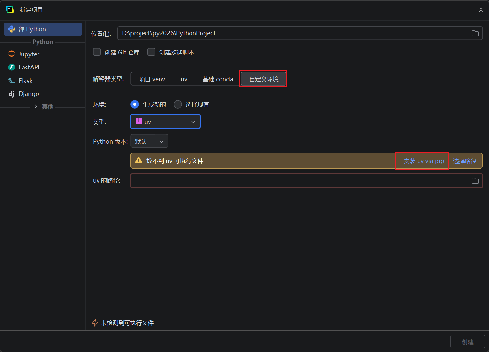
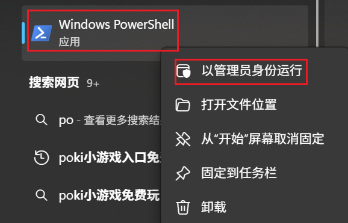
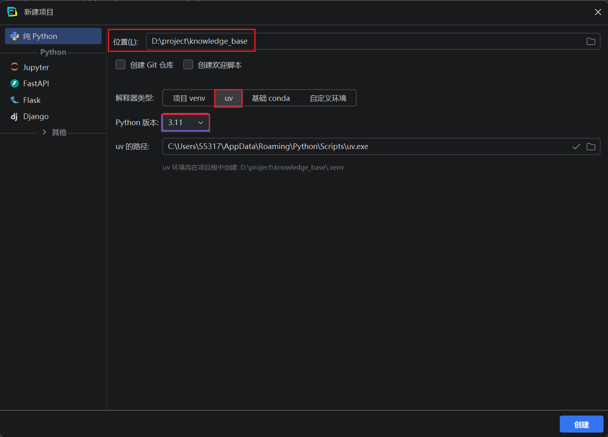
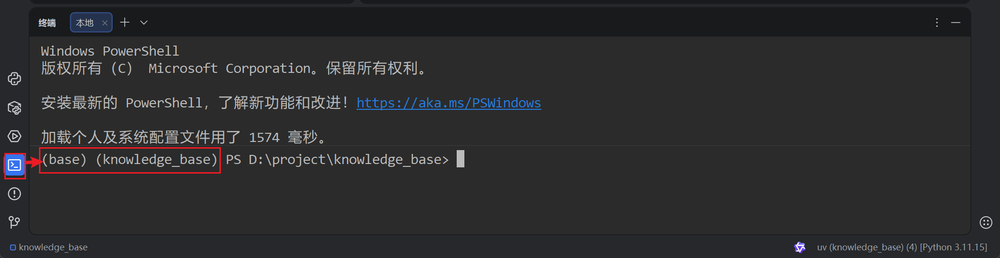
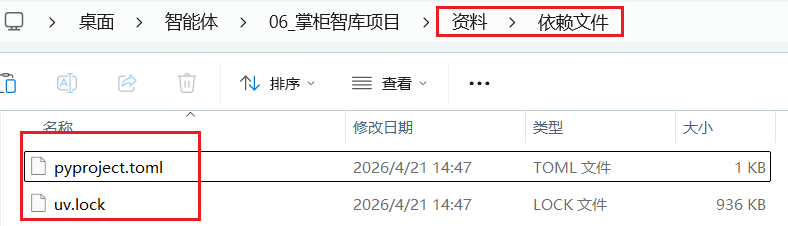
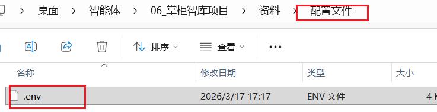
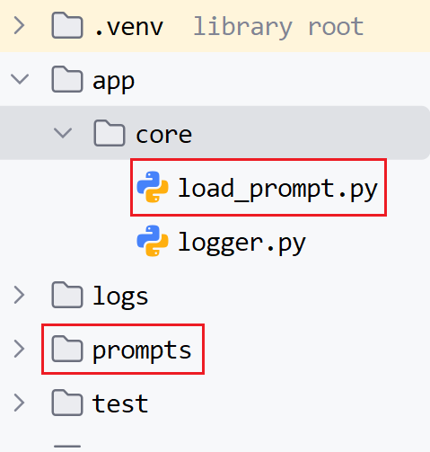

# 掌柜智库项目(RAG)实战

## 3. 环境准备

### 3.1 虚拟环境创建

#### 3.1.1 安装uv

使用 `uv` 方式创建虚拟环境，如果之前用其他方式安装过 `uv` 则此处会自动识别出 `uv` 路径，如果没安装过 `uv` 直接点击 `安装 uv via pip`


`PyCharm`版本没有 `uv` 选项，则选择 `自定义环境`，类型选 `uv`，然后再点击 `安装 uv via pip`



安装完uv 后将 uv 路径配置在系统的 `Path` 环境变量中：例如我的路径是 `C:\Users\用户名\AppData\Roaming\Python\Scripts`

#### 3.1.2 配置镜像源

为uv命令配置国内镜像源。

以管理员身份运行`Windows PowerShell`



如果运行报如下错误：


则在 `Windows PowerShell` 中设置安全策略允许本地脚本执行，方式如下：

```bash
Set-ExecutionPolicy Unrestricted -Scope CurrentUser
```

然后执行以下命令创建uv配置文件

```bash
# 在用户目录创建文件夹
mkdir -Force $env:APPDATA\uv
# 在文件夹中创建文件
New-Item -Path $env:APPDATA\uv\uv.toml -ItemType File
```

编辑 `uv.toml` 文件，添加以下内容 (C:\Users\admin\AppData\Roaming\uv)

```bash
# 清华镜像（推荐）
index-url = "https://pypi.tuna.tsinghua.edu.cn/simple"
# 阿里镜像
# index-url = "https://mirrors.aliyun.com/pypi/simple/"

# 可选：添加信任源（避免安装报错）
# trusted-host = ["pypi.tuna.tsinghua.edu.cn"]

#上面写法不兼容,切换成下面写法(二选一版本不同)
# 配置默认的 PyPI 镜像源 (清华源)
[[index]]
url = "https://pypi.tuna.tsinghua.edu.cn/simple"
default = true
```

#### 3.1.3 安装指定版本解释器&同步环境

打开命令行终端，执行以下命令安装 `python 3.11`

```bash
# 列出已安装版本
uv python list
uv python install 3.11
```

回到 `PyCharm` 创建项目的页面，选择 Python版本为 `3.11`，定义项目名称为 `knowledge_base` 然后创建项目



项目创建成功后，根目录下自动生成一个 `pyproject.toml`  文件。在 uv 虚拟环境中，`pyproject.toml` 是**项目依赖和配置的核心文件**，相当于项目的 “身份卡 + 依赖清单”，uv 会通过这个文件统一管理项目的 Python 版本、依赖包、构建规则等，是 uv 实现 “跨环境一致性” 的关键。

```toml
[project]
name = "pythonproject18"
version = "0.1.0"
description = "Add your description here"
requires-python = ">=3.11"
dependencies = [
    "langchain>=1.2.15",
    "requests>=2.33.1",
]

# 项目下配置环境变量(更推荐)
[[tool.uv.index]]
name = "tsinghua"
url = "https://pypi.tuna.tsinghua.edu.cn/simple"
default = true
```

克隆项目或更新 `pyproject.toml` 后，运行以下命令一键安装所有依赖：

```python
uv sync
```

但是这么做,会出现: 今天能跑、明天装了新小版本就挂”的漂移问题。

生成/更新锁文件

```
uv lock
```

该命令会解析 `pyproject.toml` 中的依赖并生成（或更新）`uv.lock` 文件。`uv.lock` 应该提交到版本库，确保团队所有成员使用完全相同的依赖版本。

#### 3.1.4 激活当前虚拟环境

打开 **PyCharm的终端**，当前虚拟环境会自动被激活



没有自动(没有项目标识)可以手动激活:

```cmd
# 在当前目录创建名为 .venv 的虚拟环境（使用系统默认 Python）
uv venv

# 使用指定 Python 版本创建虚拟环境
uv venv --python 3.12

# 激活虚拟环境：
# macOS / Linux
source .venv/bin/activate

# Windows（PowerShell）
.venv\Scripts\activate

# 退出虚拟环境：
deactivate
```

#### 3.1.5 使用uv进行包管理

uv 提供了与 pip 完全兼容的命令接口，可以直接替换已有工作流中的 pip 命令：

安装包：

```
# 安装包
uv pip install requests                  # 安装最新版本
uv pip install requests==2.31.0          # 安装特定版本
uv pip install -r requirements.txt       # 从 requirements.txt 批量安装

# 升级/卸载/查看包
uv pip install --upgrade requests        # 升级包
uv pip uninstall requests                # 卸载包
uv pip list                              # 查看已安装的包

# 导出依赖
uv pip freeze > requirements.txt         # 导出当前环境依赖到 requirements.txt
```

在项目模式下，推荐使用 `uv add` 和 `uv remove` 管理依赖，它们会自动更新 `pyproject.toml` 和 `uv.lock`：

```
# 添加生产依赖
uv add requests

# 添加指定版本的依赖
uv add "requests>=2.31.0"

# 移除依赖
uv remove requests
```

**优先用 `uv add` 的场景（核心推荐）**

- 安装项目核心依赖（如loguru、langchain、FlagEmbedding、pymilvus等）：这类依赖是项目长期运行的基础，uv add会将其写入pyproject.toml，并生成uv.lock

  锁定版本，避免团队协作 / 部署时版本漂移。

- 安装开发依赖（如测试、格式化工具）：用uv add --dev xxx区分开发 / 生产依赖，生产环境同步时（uv sync --prod）自动剔除冗余依赖。

- 常规依赖安装（无特殊镜像 / 参数需求）：如numpy、pandas、fastapi等，通过uv add统一管理，契合项目

  pyproject.toml核心配置体系。

**仅用 `uv pip` 的场景（特殊需求）**

- 安装 PyTorch：

  需指定 CUDA 专属镜像源（--index-url https://download.pytorch.org/whl/cu124），

  uv pip支持自定义--index-url参数，适配这类特殊安装需求；

- 临时测试 / 调试依赖：

  比如临时装包验证功能，测试完无需保留依赖记录，避免污染pyproject.toml；

- 迁移旧requirements.txt依赖：若有历史requirements.txt，可先用uv pip install -r requirements.txt快速安装，再逐步迁移到uv add标准化管理。

### 3.2 基础结构搭建

#### 3.2.1 项目依赖同步

* 导入项目依赖文件

  

* 修改项目命名

  ```
  [project]
  name = "dataset-rag"  ->  改成你新的项目名称
  ```

* 检查python版本

  ```
  requires-python = ">=3.11"  和创建项目选择版本匹配
  ```

* 进行同步 

  ```
  uv sync
  ```

* 检查和对比同步树

  ```
  uv tree 
  
  项目名称 v0.1.0
  ├── datasets v4.8.4
  │   ├── dill v0.4.1
  │   ├── filelock v3.25.2
  │   ├── fsspec[http] v2026.2.0
  │   │   └── aiohttp v3.13.3 (extra: http)
  │   │       ├── aiohappyeyeballs v2.6.1
  │   │       ├── aiosignal v1.4.0
  │   │       │   ├── frozenlist v1.8.0
  │   │       │   └── typing-extensions v4.15.0
  │   │       ├── attrs v26.1.0
  │   │       ├── frozenlist v1.8.0
  │   │       ├── multidict v6.7.1
  │   │       ├── propcache v0.4.1
  │   │       └── yarl v1.23.0
  │   │           ├── idna v3.11
  │   │           ├── multidict v6.7.1
  │   │           └── propcache v0.4.1
  │   ├── httpx v0.28.1
  │   │   ├── anyio v4.12.1
  │   │   │   ├── idna v3.11
  │   │   │   └── typing-extensions v4.15.0
  │   │   ├── certifi v2026.2.25
  │   │   ├── httpcore v1.0.9
  │   │   │   ├── certifi v2026.2.25
  │   │   │   └── h11 v0.16.0
  │   │   └── idna v3.11
  │   ├── huggingface-hub v0.36.2
  │   │   ├── filelock v3.25.2
  │   │   ├── fsspec v2026.2.0 (*)
  │   │   ├── packaging v26.0
  │   │   ├── pyyaml v6.0.3
  │   │   ├── requests v2.32.5
  │   │   │   ├── certifi v2026.2.25
  │   │   │   ├── charset-normalizer v3.4.6
  │   │   │   ├── idna v3.11
  │   │   │   └── urllib3 v2.6.3
  │   │   ├── tqdm v4.67.3
  │   │   │   └── colorama v0.4.6
  │   │   └── typing-extensions v4.15.0
  │   ├── multiprocess v0.70.19
  │   │   └── dill v0.4.1
  │   ├── numpy v2.4.3
  │   ├── packaging v26.0
  │   ├── pandas v3.0.1
  │   │   ├── numpy v2.4.3
  │   │   ├── python-dateutil v2.9.0.post0
  │   │   │   └── six v1.17.0
  │   │   └── tzdata v2025.3
  │   ├── pyarrow v23.0.1
  │   ├── pyyaml v6.0.3
  │   ├── requests v2.32.5 (*)
  │   ├── tqdm v4.67.3 (*)
  │   └── xxhash v3.6.0
  ├── fastapi v0.135.1
  │   ├── annotated-doc v0.0.4
  │   ├── pydantic v2.10.6
  │   │   ├── annotated-types v0.7.0
  │   │   ├── pydantic-core v2.27.2
  │   │   │   └── typing-extensions v4.15.0
  │   │   └── typing-extensions v4.15.0
  │   ├── starlette v0.52.1
  │   │   ├── anyio v4.12.1 (*)
  │   │   └── typing-extensions v4.15.0
  │   ├── typing-extensions v4.15.0
  │   └── typing-inspection v0.4.2
  │       └── typing-extensions v4.15.0
  ├── flagembedding v1.3.5
  │   ├── accelerate v1.13.0
  │   │   ├── huggingface-hub v0.36.2 (*)
  │   │   ├── numpy v2.4.3
  │   │   ├── packaging v26.0
  │   │   ├── psutil v7.2.2
  │   │   ├── pyyaml v6.0.3
  │   │   ├── safetensors v0.7.0
  │   │   └── torch v2.10.0
  │   │       ├── filelock v3.25.2
  │   │       ├── fsspec v2026.2.0 (*)
  │   │       ├── jinja2 v3.1.6
  │   │       │   └── markupsafe v3.0.3
  │   │       ├── networkx v3.6.1
  │   │       ├── sympy v1.14.0
  │   │       │   └── mpmath v1.3.0
  │   │       └── typing-extensions v4.15.0
  │   ├── datasets v4.8.4 (*)
  │   ├── ir-datasets v0.5.11
  │   │   ├── beautifulsoup4 v4.14.3
  │   │   │   ├── soupsieve v2.8.3
  │   │   │   └── typing-extensions v4.15.0
  │   │   ├── ijson v3.5.0
  │   │   ├── inscriptis v2.7.1
  │   │   │   ├── lxml v6.0.2
  │   │   │   └── requests v2.32.5 (*)
  │   │   ├── lxml v6.0.2
  │   │   ├── lz4 v4.4.5
  │   │   ├── numpy v2.4.3
  │   │   ├── pyarrow v23.0.1
  │   │   ├── pyyaml v6.0.3
  │   │   ├── requests v2.32.5 (*)
  │   │   ├── tqdm v4.67.3 (*)
  │   │   ├── trec-car-tools v2.6
  │   │   │   ├── cbor v1.0.0
  │   │   │   └── numpy v2.4.3
  │   │   ├── unlzw3 v0.2.3
  │   │   ├── warc3-wet v0.2.5
  │   │   ├── warc3-wet-clueweb09 v0.2.5
  │   │   └── zlib-state v0.1.10
  │   ├── peft v0.18.1
  │   │   ├── accelerate v1.13.0 (*)
  │   │   ├── huggingface-hub v0.36.2 (*)
  │   │   ├── numpy v2.4.3
  │   │   ├── packaging v26.0
  │   │   ├── psutil v7.2.2
  │   │   ├── pyyaml v6.0.3
  │   │   ├── safetensors v0.7.0
  │   │   ├── torch v2.10.0 (*)
  │   │   ├── tqdm v4.67.3 (*)
  │   │   └── transformers v4.57.6
  │   │       ├── filelock v3.25.2
  │   │       ├── huggingface-hub v0.36.2 (*)
  │   │       ├── numpy v2.4.3
  │   │       ├── packaging v26.0
  │   │       ├── pyyaml v6.0.3
  │   │       ├── regex v2026.2.28
  │   │       ├── requests v2.32.5 (*)
  │   │       ├── safetensors v0.7.0
  │   │       ├── tokenizers v0.22.2
  │   │       │   └── huggingface-hub v0.36.2 (*)
  │   │       └── tqdm v4.67.3 (*)
  │   ├── protobuf v7.34.1
  │   ├── sentence-transformers v5.3.0
  │   │   ├── huggingface-hub v0.36.2 (*)
  │   │   ├── numpy v2.4.3
  │   │   ├── scikit-learn v1.8.0
  │   │   │   ├── joblib v1.5.3
  │   │   │   ├── numpy v2.4.3
  │   │   │   ├── scipy v1.17.1
  │   │   │   │   └── numpy v2.4.3
  │   │   │   └── threadpoolctl v3.6.0
  │   │   ├── scipy v1.17.1 (*)
  │   │   ├── torch v2.10.0 (*)
  │   │   ├── tqdm v4.67.3 (*)
  │   │   ├── transformers v4.57.6 (*)
  │   │   └── typing-extensions v4.15.0
  │   ├── sentencepiece v0.2.1
  │   ├── torch v2.10.0 (*)
  │   └── transformers v4.57.6 (*)
  ├── grandalf v0.8
  │   └── pyparsing v3.3.2
  ├── langchain v1.2.13
  │   ├── langchain-core v1.2.20
  │   │   ├── jsonpatch v1.33
  │   │   │   └── jsonpointer v3.1.0
  │   │   ├── langsmith v0.7.22
  │   │   │   ├── httpx v0.28.1 (*)
  │   │   │   ├── orjson v3.11.7
  │   │   │   ├── packaging v26.0
  │   │   │   ├── pydantic v2.10.6 (*)
  │   │   │   ├── requests v2.32.5 (*)
  │   │   │   ├── requests-toolbelt v1.0.0
  │   │   │   │   └── requests v2.32.5 (*)
  │   │   │   ├── uuid-utils v0.14.1
  │   │   │   ├── xxhash v3.6.0
  │   │   │   └── zstandard v0.25.0
  │   │   ├── packaging v26.0
  │   │   ├── pydantic v2.10.6 (*)
  │   │   ├── pyyaml v6.0.3
  │   │   ├── tenacity v9.1.4
  │   │   ├── typing-extensions v4.15.0
  │   │   └── uuid-utils v0.14.1
  │   ├── langgraph v1.1.3
  │   │   ├── langchain-core v1.2.20 (*)
  │   │   ├── langgraph-checkpoint v4.0.1
  │   │   │   ├── langchain-core v1.2.20 (*)
  │   │   │   └── ormsgpack v1.12.2
  │   │   ├── langgraph-prebuilt v1.0.8
  │   │   │   ├── langchain-core v1.2.20 (*)
  │   │   │   └── langgraph-checkpoint v4.0.1 (*)
  │   │   ├── langgraph-sdk v0.3.12
  │   │   │   ├── httpx v0.28.1 (*)
  │   │   │   └── orjson v3.11.7
  │   │   ├── pydantic v2.10.6 (*)
  │   │   └── xxhash v3.6.0
  │   └── pydantic v2.10.6 (*)
  ├── langchain-community v0.4.1
  │   ├── aiohttp v3.13.3 (*)
  │   ├── dataclasses-json v0.6.7
  │   │   ├── marshmallow v3.26.2
  │   │   │   └── packaging v26.0
  │   │   └── typing-inspect v0.9.0
  │   │       ├── mypy-extensions v1.1.0
  │   │       └── typing-extensions v4.15.0
  │   ├── httpx-sse v0.4.3
  │   ├── langchain-classic v1.0.3
  │   │   ├── langchain-core v1.2.20 (*)
  │   │   ├── langchain-text-splitters v1.1.1
  │   │   │   └── langchain-core v1.2.20 (*)
  │   │   ├── langsmith v0.7.22 (*)
  │   │   ├── pydantic v2.10.6 (*)
  │   │   ├── pyyaml v6.0.3
  │   │   ├── requests v2.32.5 (*)
  │   │   └── sqlalchemy v2.0.48
  │   │       ├── greenlet v3.3.2
  │   │       └── typing-extensions v4.15.0
  │   ├── langchain-core v1.2.20 (*)
  │   ├── langsmith v0.7.22 (*)
  │   ├── numpy v2.4.3
  │   ├── pydantic-settings v2.13.1
  │   │   ├── pydantic v2.10.6 (*)
  │   │   ├── python-dotenv v1.2.2
  │   │   └── typing-inspection v0.4.2 (*)
  │   ├── pyyaml v6.0.3
  │   ├── requests v2.32.5 (*)
  │   ├── sqlalchemy v2.0.48 (*)
  │   └── tenacity v9.1.4
  ├── langchain-openai v1.1.11
  │   ├── langchain-core v1.2.20 (*)
  │   ├── openai v2.29.0
  │   │   ├── anyio v4.12.1 (*)
  │   │   ├── distro v1.9.0
  │   │   ├── httpx v0.28.1 (*)
  │   │   ├── jiter v0.13.0
  │   │   ├── pydantic v2.10.6 (*)
  │   │   ├── sniffio v1.3.1
  │   │   ├── tqdm v4.67.3 (*)
  │   │   └── typing-extensions v4.15.0
  │   └── tiktoken v0.12.0
  │       ├── regex v2026.2.28
  │       └── requests v2.32.5 (*)
  ├── langgraph v1.1.3 (*)
  ├── loguru v0.7.3
  │   ├── colorama v0.4.6
  │   └── win32-setctime v1.2.0
  ├── magic-pdf v1.3.12
  │   ├── boto3 v1.42.73
  │   │   ├── botocore v1.42.73
  │   │   │   ├── jmespath v1.1.0
  │   │   │   ├── python-dateutil v2.9.0.post0 (*)
  │   │   │   └── urllib3 v2.6.3
  │   │   ├── jmespath v1.1.0
  │   │   └── s3transfer v0.16.0
  │   │       └── botocore v1.42.73 (*)
  │   ├── brotli v1.2.0
  │   ├── click v8.3.1
  │   │   └── colorama v0.4.6
  │   ├── fast-langdetect v0.2.5
  │   │   ├── fasttext-predict v0.9.2.4
  │   │   ├── requests v2.32.5 (*)
  │   │   └── robust-downloader v0.0.2
  │   │       ├── colorlog v6.10.1
  │   │       │   └── colorama v0.4.6
  │   │       ├── requests v2.32.5 (*)
  │   │       └── tqdm v4.67.3 (*)
  │   ├── loguru v0.7.3 (*)
  │   ├── numpy v2.4.3
  │   ├── pdfminer-six v20250506
  │   │   ├── charset-normalizer v3.4.6
  │   │   └── cryptography v46.0.5
  │   │       └── cffi v2.0.0
  │   │           └── pycparser v3.0
  │   ├── pydantic v2.10.6 (*)
  │   ├── pymupdf v1.24.14
  │   ├── scikit-learn v1.8.0 (*)
  │   ├── torch v2.10.0 (*)
  │   ├── torchvision v0.25.0
  │   │   ├── numpy v2.4.3
  │   │   ├── pillow v12.1.1
  │   │   └── torch v2.10.0 (*)
  │   ├── tqdm v4.67.3 (*)
  │   └── transformers v4.57.6 (*)
  ├── mineru-kie-sdk v0.1.1
  │   ├── aiohttp v3.13.3 (*)
  │   ├── filetype v1.2.0
  │   ├── func-timeout v4.3.5
  │   └── requests v2.32.5 (*)
  ├── minio v7.2.20
  │   ├── argon2-cffi v25.1.0
  │   │   └── argon2-cffi-bindings v25.1.0
  │   │       └── cffi v2.0.0 (*)
  │   ├── certifi v2026.2.25
  │   ├── pycryptodome v3.23.0
  │   ├── typing-extensions v4.15.0
  │   └── urllib3 v2.6.3
  ├── modelscope v1.35.1
  │   ├── filelock v3.25.2
  │   ├── packaging v26.0
  │   ├── requests v2.32.5 (*)
  │   ├── setuptools v82.0.1
  │   ├── tqdm v4.67.3 (*)
  │   └── urllib3 v2.6.3
  ├── numpy v2.4.3
  ├── openai-agents v0.4.2
  │   ├── griffe v1.15.0
  │   │   └── colorama v0.4.6
  │   ├── mcp v1.12.4
  │   │   ├── anyio v4.12.1 (*)
  │   │   ├── httpx v0.28.1 (*)
  │   │   ├── httpx-sse v0.4.3
  │   │   ├── jsonschema v4.26.0
  │   │   │   ├── attrs v26.1.0
  │   │   │   ├── jsonschema-specifications v2025.9.1
  │   │   │   │   └── referencing v0.37.0
  │   │   │   │       ├── attrs v26.1.0
  │   │   │   │       ├── rpds-py v0.30.0
  │   │   │   │       └── typing-extensions v4.15.0
  │   │   │   ├── referencing v0.37.0 (*)
  │   │   │   └── rpds-py v0.30.0
  │   │   ├── pydantic v2.10.6 (*)
  │   │   ├── pydantic-settings v2.13.1 (*)
  │   │   ├── python-multipart v0.0.22
  │   │   ├── pywin32 v311
  │   │   ├── sse-starlette v3.3.4
  │   │   │   ├── anyio v4.12.1 (*)
  │   │   │   └── starlette v0.52.1 (*)
  │   │   ├── starlette v0.52.1 (*)
  │   │   └── uvicorn v0.42.0
  │   │       ├── click v8.3.1 (*)
  │   │       └── h11 v0.16.0
  │   ├── openai v2.29.0 (*)
  │   ├── pydantic v2.10.6 (*)
  │   ├── requests v2.32.5 (*)
  │   ├── types-requests v2.33.0.20260402
  │   │   └── urllib3 v2.6.3
  │   └── typing-extensions v4.15.0
  ├── pandas v3.0.1 (*)
  ├── pymilvus[model] v2.6.10
  │   ├── cachetools v7.0.5
  │   ├── grpcio v1.78.0
  │   │   └── typing-extensions v4.15.0
  │   ├── orjson v3.11.7
  │   ├── pandas v3.0.1 (*)
  │   ├── protobuf v7.34.1
  │   ├── python-dotenv v1.2.2
  │   ├── requests v2.32.5 (*)
  │   ├── setuptools v82.0.1
  │   └── pymilvus-model v0.3.2 (extra: model)
  │       ├── numpy v2.4.3
  │       ├── onnxruntime v1.24.4
  │       │   ├── flatbuffers v25.12.19
  │       │   ├── numpy v2.4.3
  │       │   ├── packaging v26.0
  │       │   ├── protobuf v7.34.1
  │       │   └── sympy v1.14.0 (*)
  │       ├── protobuf v7.34.1
  │       ├── scipy v1.17.1 (*)
  │       └── transformers v4.57.6 (*)
  ├── pymilvus-model v0.3.2 (*)
  ├── pymongo v4.16.0
  │   └── dnspython v2.8.0
  ├── python-dotenv v1.2.2
  ├── python-multipart v0.0.22
  ├── regex v2026.2.28
  ├── requests v2.32.5 (*)
  ├── torch v2.10.0 (*)
  ├── torchaudio v2.10.0
  │   └── torch v2.10.0 (*)
  ├── torchvision v0.25.0 (*)
  ├── transformers v4.57.6 (*)
  └── uvicorn v0.42.0 (*)
  ```

#### 3.2.2  项目配置文件

> **资料** / 配置文件
>
> `.env` 文件（不提交到Git，配置apikey）



测试环境变量的读取

```python
# test/01_env_test.py
import os
from dotenv import load_dotenv

load_dotenv(
    override=True
)

print(os.environ.get("BGE_M3_PATH"))
# load_dotenv(override=True) → 输出 dotenv_val（.env覆盖系统）
```

#### 3.2.3 统一日志工具

##### 3.2.3.1 安装依赖

`loguru` 是 Python 中一款**开箱即用、功能强大且极简的日志工具**，核心作用是替代 Python 标准库的 `logging` 模块，解决原生日志配置繁琐、用法不友好的问题。我用新手能看懂的方式讲清楚它的核心作用和优势：

```bash
[已导入]
uv add loguru
或
pip uv install loguru  
```

##### 3.2.3.2 日志模块代码

> **资料**
>
> `app/core/logger.py`

##### 3.2.3.3 测试日志记录

```python
"""
项目日志工具类
基于loguru实现，支持.env配置控制台/文件双输出，自动生成logs/app_年月日.log
特性：
1. 配置驱动：通过.env开关输出、修改日志级别
2. 自动路径：文件日志默认输出到 项目根/logs/app_YYYYMMDD.log
3. 自动清理：按配置保留日志，自动删除过期文件
4. 中文友好：utf-8编码，彻底解决中文乱码
5. 异步安全：开启异步入队，支持多线程/异步场景，避免日志错乱
6. 开箱即用：项目所有模块直接导入logger即可使用
7. 位置终极精准：穿透loguru内部+工具类自身，完美显示业务模块实际调用位置
"""
import sys
import inspect
from pathlib import Path
import os
from dotenv import load_dotenv
from loguru import logger


# -------------------------- 第一步：加载.env配置文件 --------------------------
load_dotenv()

# -------------------------- 第二步：读取.env配置（带默认值，防止配置缺失） --------------------------
LOG_CONSOLE_ENABLE = os.getenv("LOG_CONSOLE_ENABLE", "True").lower() == "true"
LOG_CONSOLE_LEVEL = os.getenv("LOG_CONSOLE_LEVEL", "INFO").upper()
LOG_FILE_ENABLE = os.getenv("LOG_FILE_ENABLE", "True").lower() == "true"
LOG_FILE_LEVEL = os.getenv("LOG_FILE_LEVEL", "INFO").upper()
LOG_FILE_RETENTION = os.getenv("LOG_FILE_RETENTION", "7 days")

# -------------------------- 第三步：定义日志路径（自动推导项目根） --------------------------
PROJECT_ROOT = Path(__file__).resolve().parent.parent.parent
LOG_DIR = PROJECT_ROOT / "logs"
LOG_FILE_NAME = "app_{time:YYYYMMDD}.log"
LOG_FILE_PATH = LOG_DIR / LOG_FILE_NAME

# -------------------------- 第四步：定义日志格式（彩色、结构化、易读） --------------------------
LOG_FORMAT = (
    "<green>{time:YYYY-MM-DD HH:mm:ss.SSS}</green> | "
    "<level>{level: <8}</level> | "
    "<cyan>{name: <20}</cyan>:<cyan>{function: <15}</cyan>:<cyan>{line: <4}</cyan> - "
    "<level>{message}</level>"
)

# -------------------------- 第五步：初始化日志配置（核心方法） --------------------------
def init_logger():
    """
    初始化全局日志配置
    1. 移除loguru默认控制台输出（避免重复打印）
    2. 根据.env配置开启/关闭控制台输出
    3. 根据.env配置开启/关闭文件输出（自动创建logs文件夹）
    4. 配置日志格式、级别、分割、保留策略
    :return: 配置完成的loguru logger实例
    """
    # 1. 移除loguru默认的控制台输出
    logger.remove()

    # 2. 配置控制台输出（若.env开启）
    if LOG_CONSOLE_ENABLE:
        logger.add(
            sink=sys.stdout,
            level=LOG_CONSOLE_LEVEL,
            format=LOG_FORMAT,
            colorize=True,
            enqueue=True
        )

    # 3. 配置文件输出（若.env开启）
    if LOG_FILE_ENABLE:
        LOG_DIR.mkdir(parents=True, exist_ok=True)
        logger.add(
            sink=LOG_FILE_PATH,
            level=LOG_FILE_LEVEL,
            format=LOG_FORMAT,
            rotation="00:00",
            retention=LOG_FILE_RETENTION,
            encoding="utf-8",
            enqueue=True,
            backtrace=True,
            diagnose=True
        )

    return logger

# -------------------------- 第六步：初始化并终极修正全局logger --------------------------
base_logger = init_logger()

def fix_log_position(record):
    """遍历调用栈，跳过loguru内部帧+工具类自身帧，提取业务代码实际调用位置"""
    for frame in inspect.stack():
        # 终极过滤：排除loguru内部 + 排除工具类logger.py自身，直接定位业务模块
        if ("_logger.py" in frame.filename or frame.function == "_log") or "logger.py" in frame.filename:
            continue
        # 更新日志字段为业务代码实际位置
        record.update(
            name=frame.filename.split("/")[-1].split("\\")[-1],
            function=frame.function,
            line=frame.lineno
        )
        break

# 应用终极修复，导出全局可用的logger
logger = base_logger.patch(fix_log_position)


from functools import wraps
import time
from typing import Mapping

def _trace_id(state) -> str:
    if isinstance(state, Mapping):
        return str(state.get("session_id") or state.get("task_id") or "-")
    return "-"

def node_log(node_name: str):
    def deco(func):
        @wraps(func)
        def wrapper(state, *args, **kwargs):
            trace_id = _trace_id(state)
            start_ts = time.time()
            logger.info(f"[{node_name}] 节点开始，追踪ID={trace_id}")
            try:
                result = func(state, *args, **kwargs)
                cost_ms = int((time.time() - start_ts) * 1000)
                logger.info(f"[{node_name}] 节点完成，追踪ID={trace_id}，耗时={cost_ms}ms")
                return result
            except Exception:
                logger.exception(f"[{node_name}] 节点异常，追踪ID={trace_id}")
                raise
        return wrapper
    return deco

def step_log(step_name: str):
    """
    步骤日志装饰器：
    - 自动打印 步骤开始 / 步骤完成 / 步骤异常（含堆栈）
    - 不吞异常，保持原有业务语义
    """
    def deco(func):
        @wraps(func)
        def wrapper(*args, **kwargs):
            start_ts = time.time()
            logger.info(f"[{step_name}] 步骤开始")
            try:
                result = func(*args, **kwargs)
                cost_ms = int((time.time() - start_ts) * 1000)
                logger.info(f"[{step_name}] 步骤完成，耗时={cost_ms}ms")
                return result
            except Exception:
                logger.exception(f"[{step_name}] 步骤异常")
                raise
        return wrapper
    return deco

# -------------------------- 测试代码（验证修复效果） --------------------------
if __name__ == '__main__':
    logger.info("【测试】logger.py内部调用（仅测试，业务模块调用会显示正确文件名）")
    print(f"日志文件输出路径：{LOG_FILE_PATH}")
    logger.error("【测试】logger.py内部调用（仅测试，业务模块调用会显示正确文件名）")

    # 异常堆栈演示：logger.exception() 需要放在 except 代码块中
    try:
        # 伪代码：模拟业务异常（例如数据库查询、网络调用、文件解析等）
        result = 10 / 0
        logger.info(f"业务结果：{result}")
    except Exception:
        logger.exception("【测试】捕获到业务异常，输出完整堆栈信息")
```

修改`.env`文件中的`日志配置`进行测试，例如 `LEVEL、ENABLE`

```python
# ===================== 日志配置 =====================
# 控制台日志：True=开启/False=关闭，级别可选(DEBUG/INFO/WARNING/ERROR/CRITICAL)
LOG_CONSOLE_ENABLE=True
LOG_CONSOLE_LEVEL=INFO

# 日志配置
# 文件日志：True=开启/False=关闭，级别与控制台可独立设置
LOG_FILE_ENABLE=True
LOG_FILE_LEVEL=ERROR
# 日志文件保留天数（自动删除过期日志，避免磁盘占满）
LOG_FILE_RETENTION=7 days
```

#### 3.2.4 准备提示词和导入工具

> **资料** / 提示文件
>
> `prompts`
> `app/core/load_prompt.py`



#### 3.2.5 其他工具类导入

> **资料** / 公共工具类
>
> `app/tool`
> `app/utils`
>
> `app/clients`
> `app/conf``
> ``app/lm`

#### 3.2.6 PDF文件

> **资料** / doc
>
> `设备手册`放入项目根目录`doc`文件夹

### 3.3 安装torch(了解先不装,我们使用CPU版本)

**torch：**PyTorch 深度学习框架，**为向量模型（BGE-M3）提供运行环境**，支撑模型的加载、推理、张量计算，是大部分深度学习模型的基础依赖。

**安装哪个版本：**

- **cu124 源**
  
  - 给 PyTorch 装上 “GPU 加速器”，只有你的电脑 / 服务器有 NVIDIA GPU，且装了对应驱动，才能用上这个加速器；如果没有 GPU，装了也没用（PyTorch 会自动降级到 CPU 运行）。
  - `cu124` 对应 CUDA 12.4，你的 NVIDIA 驱动版本需≥`545.23`（可通过 `nvidia-smi` 查看驱动版本）；
  - 如果驱动版本低（比如只支持 CUDA 12.1），需换 `cu121` 源（`https://download.pytorch.org/whl/cu121`），否则会报错。
  
  | 显卡架构     | 算力版本 | 显卡系列    | 具体型号                                                     |
  | ------------ | -------- | ----------- | ------------------------------------------------------------ |
  | Blackwell    | sm_100   | RTX 50 系列 | RTX 5090、5080、5070、5060、5050、5060 Ti、5070 Ti、5080 Ti、5090 Ti |
  | Ada Lovelace | sm_89    | RTX 40 系列 | RTX 4090、4080、4070、4070 Ti、4060、4060 Ti、4050、RTX 4000 SFF、RTX 5000、RTX 6000 |
  | Ampere       | sm_86    | RTX 30 系列 | RTX 3090 Ti、3090、3080 Ti、3080、3070 Ti、3070、3060 Ti、3060、3050、RTX A2000、A3000、A4000、A5000、A6000 |
  | Turing       | sm_75    | RTX 20 系列 | RTX 2080 Ti、2080 Super、2080、2070 Super、2070、2060 Super、2060、Titan RTX、RTX 5000、6000、8000 |
  | Turing       | sm_75    | GTX 16 系列 | GTX 1660 Ti、1660 Super、1660、1650 Super、1650              |
  | Pascal       | sm_61    | GTX 10 系列 | GTX 1080 Ti、1080、1070 Ti、1070、1060、1050 Ti、1050、Titan Xp、Titan X |
  | Maxwell      | sm_52    | GTX 9 系列  | GTX 980 Ti、980、970、960、950、Titan X                      |
- **cpu 源**
  
  - PyTorch 的 “基础版”，不管有没有 GPU，都只能用 CPU 干活，优点是体积小、不挑环境，缺点是速度慢。

**下载PyTorch：**

正常情况下使用 uv add 就可以安装依赖，但是对于PyTorch来说最好去官网下载和计算机对应的版本，因为国内普通镜像源大概率是**CPU-only 版本**，可能没有适配最新 CUDA 的版本。

```bash
# uv add torch # PyTorch核心库：张量计算+GPU/TPU加速+深度学习模型构建

# 包含 CUDA 12.4 加速模块，支持 NVIDIA GPU 运算
uv pip install --force-reinstall torch --index-url https://download.pytorch.org/whl/cu124

# 使用 CPU 
uv add torch torchvision torchaudio
```

**验证 PyTorch 是否正常加载：**

```python
# test/03-cuda测试.py
try:
    import torch
    print(f"✅ PyTorch 加载成功！版本：{torch.__version__}")
    print(f"✅ CUDA 状态：{torch.cuda.is_available()}（CPU版显示False正常）")
    print(f"✅ CUDA 设备数：{torch.cuda.device_count()}")
    print(f"✅ CUDA 设备名称：{torch.cuda.get_device_name(0)}")
except Exception as e:
    print(f"❌ PyTorch 加载失败：{e}")
```
