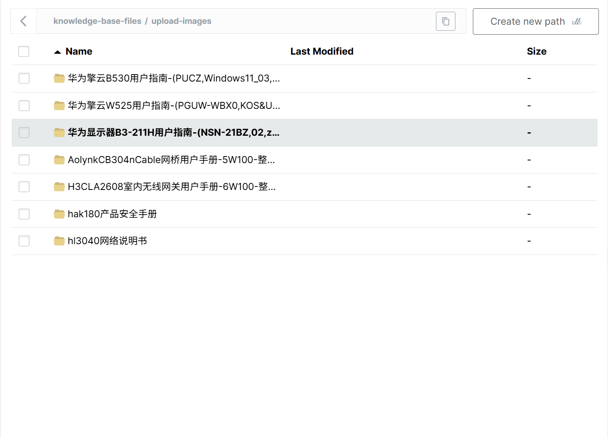

# 掌柜智库项目(RAG)实战

## 5. 导入数据节点实现与测试

### 5.3 图片处理 (node_md_img)

**文件**: `app/import_process/agent/nodes/node_md_img.py`
**相关工具类位置**: `app/clients/minio_utils.py`, `app/utils/task_utils.py`

RAG多模态知识库核心增强模块，核心目标：将Markdown中本地图片，转化为「可云端访问、可文本检索、可模型理解」的标准化多模态知识单元，解决传统RAG图片不可检索、环境切换失效的痛点，支撑多模态RAG精准问答。

**实现思路**:

1.  **图文解耦与云端持久化**：本地图片批量上传至MinIO，实现存储与计算分离，保障跨环境可访问、高可用，支撑大规模知识库扩展。
2.  **视觉语义增强**：引入VLM多模态模型，结合图片上下文，生成精准中文语义描述，让图片具备文本检索能力，填补传统RAG视觉知识盲区（区别于单纯OCR识别）。
3.  **企业级稳定性保障**：内置API速率控制（令牌桶算法）、格式校验、旧资源清理、异常捕获，确保大批量图片处理稳定无崩溃。
4.  **全流程自动化**：从扫描、语义生成、上传、替换到保存，全程无人工干预，不改变原有MD格式，无缝对接后续节点。

#### 步骤分解

1.  **Step 1：初始化校验**：读取MD路径与内容，校验文件合法性，定位同级images文件夹。
2.  **Step 2：图片扫描与上下文匹配**：筛选支持格式的图片，校验MD引用关系，截取图片前后各100字符上下文。
3.  **Step 3：VLM语义生成**：调用千文Qwen3-VL-Flash，Base64编码图片+上下文构造请求，生成规范语义描述。
4.  **Step 4：上传与替换**：清理MinIO旧资源，批量上传图片生成在线URL，替换MD本地路径并填充alt语义。
5.  **Step 5：保存与状态更新**：生成「原文件名_new.md」备份，更新流程状态，完成闭环。

视觉模型选择: https://rank.opencompass.org.cn/leaderboard-multimodal

| 模型                       | 核心劣势                                 | 核心优势                                                     |
| :------------------------- | :--------------------------------------- | :----------------------------------------------------------- |
| 千文Qwen3-VL-Flash（选型） | 复杂实景图理解精度略逊GPT-4V             | 中文技术场景适配优、轻量化部署、推理快（≤500ms）、开源私有化、LangChain适配好 |
| GPT-4V                     | 成本高、有隐私风险、中文适配弱、依赖外网 | 视觉理解精度最高，支持复杂场景                               |
| 通义千问VL                 | 模型体量大、推理慢、部署门槛高           | 中文适配强、精度较高                                         |
| 文心一格VL                 | 技术类图片理解弱、架构适配一般           | 中文适配好、擅长实景/艺术图                                  |
| LLaVA/MiniGPT-4（开源）    | 精度有限、维护成本高、推理慢             | 开源免费、可私有化                                           |

#### 基于LangChain大模型的配置和类

添加全局配置 .env文件

```ini
# api_key申请地址：https://bailian.console.aliyun.com/cn-beijing/?spm=5176.29597918.J_SEsSjsNv72yRuRFS2VknO.2.4d877b08ThdGtP&tab=model#/api-key
# 大模型的文档地址：https://bailian.console.aliyun.com/cn-beijing/?spm=5176.29597918.J_SEsSjsNv72yRuRFS2VknO.2.4d877b08ThdGtP&tab=doc#/doc
# Qwen3系列Flash模型，实现思考模式和非思考模式的有效融合，可在对话中切换模式。复杂推理类任务性能优秀，指令遵循、文本理解等能力显著提高。支持1M上下文长度，按照上下文长度进行阶梯计费。
LLM_DEFAULT_MODEL=qwen-flash
#Qwen3系列小尺寸视觉理解模型，实现思考模式和非思考模式的有效融合，效果优于开源版Qwen3-VL-30B-A3B，响应速度快。全面升级图像/视频理解，支持长视频长文档等超长上下文、
#空间感知与万物识别；具备视觉2D/3D定位能力，胜任复杂现实任务。
VL_MODEL=qwen3-vl-flash
OPENAI_API_KEY=your key
OPENAI_API_BASE=https://dashscope.aliyuncs.com/compatible-mode/v1
LLM_DEFAULT_TEMPERATURE=0.1
```

定义配置类，读取配置文件 

位置：`app/config/lm_config.py` 【通用配置放在app下】

```python
# 导入核心依赖：数据类、环境变量读取、路径处理
from dataclasses import dataclass
import os
from dotenv import load_dotenv

# 提前加载.env配置文件（必须在读取环境变量前执行，确保os.getenv能获取到值）
# 若.env不在项目根目录，可指定路径：load_dotenv(dotenv_path=Path(__file__).parent / ".env")
load_dotenv()


# 定义minerU服务配置
@dataclass
class LLMConfig:
    base_url: str
    api_key : str
    lv_model: str
    llm_model: str
    llm_temperature: float

lm_config = LLMConfig(
    base_url=os.getenv("OPENAI_API_BASE"),
    api_key=os.getenv("OPENAI_API_KEY"),
    lv_model=os.getenv("VL_MODEL"),
    llm_model=os.getenv("LLM_DEFAULT_MODEL"),
    llm_temperature=float(os.getenv("LLM_DEFAULT_TEMPERATURE"))
)
```

首先引入必要的库，并加载环境变量配置。

定义大模型工具类

位置：`app/lm/llm_utils.py`

```python
# 环境配置与依赖导入
import os
from dotenv import load_dotenv
from langchain_openai import ChatOpenAI
from langchain_core.exceptions import LangChainException
from typing import Optional

# 项目内部依赖
from app.conf.lm_config import lm_config
from app.core.logger import logger

# 全局缓存：键为(模型名, JSON输出模式)元组，值为ChatOpenAI实例
# 作用：避免重复初始化客户端，提升性能，统一实例管理
_llm_client_cache = {}


def get_llm_client(model: Optional[str] = None, json_mode: bool = False) -> ChatOpenAI:
    """
    获取带全局缓存的LangChain ChatOpenAI客户端实例
    适配OpenAI/千问/即梦AI等**OpenAI兼容API**，支持自定义模型和JSON标准化输出
    核心特性：缓存机制+配置统一加载+异常精准捕获+国产模型参数适配

    :param model: 模型名称，优先级：传入参数 > 配置文件lm_config.llm_model > 内置默认qwen3-32b
    :param json_mode: 是否开启JSON输出模式，开启后返回标准json_object格式（适配结构化数据解析）
    :return: 初始化完成的ChatOpenAI实例（优先从全局缓存获取，未命中则新建并缓存）
    :raise ValueError: 缺失API密钥/基础地址等核心配置
    :raise Exception: 模型初始化失败（LangChain封装层异常）
    """
    # 1. 确定目标模型（优先级递减，保证模型名非空）
    target_model = model or lm_config.llm_model or "qwen3-32b"
    # 缓存键：模型名+JSON模式，唯一标识不同配置的客户端
    cache_key = (target_model, json_mode)

    # 2. 缓存命中：直接返回已初始化的实例，避免重复创建
    if cache_key in _llm_client_cache:
        logger.debug(f"[LLM客户端] 缓存命中，直接返回实例：模型={target_model}，JSON模式={json_mode}")
        return _llm_client_cache[cache_key]

    # 3. 核心配置校验：拦截缺失的API关键配置，提前抛出明确异常
    if not lm_config.api_key:
        raise ValueError("[LLM客户端] 配置缺失：请在.env中配置OPENAI_API_KEY（大模型API密钥）")
    if not lm_config.base_url:
        raise ValueError("[LLM客户端] 配置缺失：请在.env中配置OPENAI_API_BASE（API接口基础地址）")
    logger.info(f"[LLM客户端] 开始初始化新实例：模型={target_model}，JSON模式={json_mode}")

    # 4. 配置参数组装：区分「国产模型私有参数」和「OpenAI通用参数」
    # extra_body：千问/即梦等国产模型专属私有参数（LangChain透传至API）
    extra_body = {"enable_thinking": False}  # 千问专属：关闭思考链输出，减少冗余内容
    # model_kwargs：OpenAI通用参数，所有兼容API均支持
    model_kwargs = {}
    if json_mode:
        # 开启JSON标准输出模式，强制模型返回可解析的json_object
        model_kwargs["response_format"] = {"type": "json_object"}
        logger.debug(f"[LLM客户端] 已开启JSON输出模式，模型将返回标准JSON结构")

    # 5. 客户端初始化：捕获LangChain封装层异常，抛出更友好的提示
    try:
        llm_client = ChatOpenAI(
            model=target_model,  # 目标模型名
            temperature=lm_config.llm_temperature or 0.1,  # 低温度保证输出确定性（0~1）
            api_key=lm_config.api_key,  # API密钥
            base_url=lm_config.base_url,  # API基础地址（适配国产模型代理地址）
            extra_body=extra_body,  # 国产模型私有参数透传
            model_kwargs=model_kwargs,  # OpenAI通用参数
        )
    except LangChainException as e:
        raise Exception(f"[LLM客户端] 模型【{target_model}】初始化失败（LangChain层）：{str(e)}") from e

    # 6. 新实例存入全局缓存，供后续调用复用
    _llm_client_cache[cache_key] = llm_client
    logger.info(f"[LLM客户端] 实例初始化成功并缓存：模型={target_model}，JSON模式={json_mode}")

    return llm_client


# 测试示例：验证客户端创建、缓存机制及日志输出
if __name__ == "__main__":
    logger.info("===== 开始执行LLM客户端工具测试 =====")
    try:
        # 测试1：默认配置（默认模型+普通模式）
        client1 = get_llm_client()
        logger.info("✅ 测试1通过：默认配置客户端创建成功")

        # 测试2：指定多模态模型（qwen-vl-plus）+ 普通模式
        client2 = get_llm_client(model="qwen-vl-plus")
        logger.info("✅ 测试2通过：指定多模态模型客户端创建成功")

        # 测试3：同一模型+模式，验证缓存命中
        client3 = get_llm_client(model="qwen-vl-plus")
        logger.info(f"✅ 测试3通过：缓存机制验证成功，client2与client3为同一实例：{client2 is client3}")

        # 测试4：开启JSON输出模式
        client4 = get_llm_client(model="qwen3-32b", json_mode=True)
        logger.info("✅ 测试4通过：JSON输出模式客户端创建成功")

    except Exception as e:
        logger.error(f"❌ LLM客户端工具测试失败：{str(e)}", exc_info=True)
    finally:
        logger.info("===== LLM客户端工具测试结束 =====")
```

#### 工具类支持: MinIO 客户端

封装 MinIO 客户端的初始化过程，支持从环境变量读取配置。
特别之处在于，初始化时会自动检查并创建默认的 Bucket（如果不存在），减少手动运维成本。
采用模块级变量 `minio_client` 作为单例，避免重复建立连接。 

https://www.minio.org.cn/docs/minio/linux/developers/python/API.html

**步骤1：使用Docker启动Minio** 

```cmd
docker run -d --name minio \
    -p 9000:9000 -p 9001:9001 \
    -e "MINIO_ROOT_USER=minioadmin" \
    -e "MINIO_ROOT_PASSWORD=minioadmin" \
    -v $(pwd)/volumes/minio/data:/data \
    quay.io/minio/minio server /data --console-address ":9001"
    
sudo docker stop minio
docker start minio
# 实时查看日志（按 Ctrl+C 退出）
docker logs -f minio
```

MinIO 在 **2025 年 5 月之后的社区版** 中，**完全移除了 Web 控制台（9001 端口）的权限管理入口**（包括 Identity、Policies 等菜单），仅保留「文件 / 桶的基础浏览上传功能」，这是官方对社区版的功能精简（商业版仍保留完整控制台权限功能）。

**步骤2：编写minio使用工具类**

Java代码回忆：

```java
public class App {
    public static void main(String[] args) throws IOException, NoSuchAlgorithmException, InvalidKeyException {

        try {
            //构造MinIO Client （登录）
            MinioClient minioClient = MinioClient.builder()
                    .endpoint("http://192.168.10.101:9000")
                    .credentials("minioadmin", "minioadmin")
                    .build();
            
            //创建hello-minio桶
            boolean found = minioClient.bucketExists(BucketExistsArgs.builder().bucket("hello-minio").build());
            if (!found) {
                //创建hello-minio桶
                minioClient.makeBucket(MakeBucketArgs.builder().bucket("hello-minio").build());
                //设置hello-minio桶的访问权限
                String policy = """
                        {
                          "Statement" : [ {
                            "Action" : "s3:GetObject",
                            "Effect" : "Allow",
                            "Principal" : "*",
                            "Resource" : "arn:aws:s3:::hello-minio/*"
                          } ],
                          "Version" : "2012-10-17"
                        }""";
                minioClient.setBucketPolicy(SetBucketPolicyArgs.builder().bucket("hello-minio").config(policy).build());
            } else {
                System.out.println("Bucket 'hello-minio' already exists.");
            }

            //上传图片
            minioClient.uploadObject(
                    UploadObjectArgs.builder()
                            .bucket("hello-minio")
                            .object("公寓-外观.jpg")
                            .filename("D:\\workspace\\hello-minio\\src\\main\\resources\\公寓-外观.jpg")
                            .build());
            System.out.println("上传成功");
        } catch (MinioException e) {
            System.out.println("Error occurred: " + e);
        }
    }
}
```

添加minio全局配置 .env文件

```ini
#minio客户端
MINIO_ENDPOINT=http://47.94.86.115:9000
MINIO_ACCESS_KEY=minioadmin
MINIO_SECRET_KEY=minioadmin
MINIO_BUCKET_NAME=knowledge-base-files
MINIO_IMG_DIR=/upload-images
```

定义配置类，读取配置文件 

位置：`app/config/minio_config.py` 

```python
# 导入核心依赖：数据类、环境变量读取、路径处理
from dataclasses import dataclass
import os
from dotenv import load_dotenv

# 提前加载.env配置文件（确保os.getenv能获取到MinIO相关配置）
load_dotenv()


# 定义MinIO对象存储服务配置（与LLMConfig风格一致，字段对应.env配置项）
@dataclass
class MinIOConfig:
    endpoint: str    # MinIO服务地址（含http/https和端口）
    access_key: str  # MinIO访问密钥（对应MINIO_ACCESS_KEY）
    secret_key: str  # MinIO秘钥（对应MINIO_SECRET_KEY）
    bucket_name: str # MinIO默认存储桶名（知识库文件专用）
    minio_img_dir: str #Minio存储图片的文件夹


# 实例化MinIO配置对象，自动从.env读取配置并绑定
minio_config = MinIOConfig(
    endpoint=os.getenv("MINIO_ENDPOINT"),
    access_key=os.getenv("MINIO_ACCESS_KEY"),
    secret_key=os.getenv("MINIO_SECRET_KEY"),
    bucket_name=os.getenv("MINIO_BUCKET_NAME"),
    minio_img_dir=os.getenv("MINIO_IMG_DIR")
)
```

**工具类文件**: `app/clients/minio_utils.py`

```python
# 导入Python内置模块
import os
import json

# 导入MinIO官方Python SDK核心类（用于MinIO对象存储的客户端操作）
from minio import Minio

# 导入项目内部配置与日志工具
from app.conf.minio_config import minio_config  # MinIO相关配置（端点、密钥、桶名等）
from app.core.logger import logger            # 项目统一日志工具

# 全局MinIO客户端实例（单例模式，避免重复创建连接，提升性能）
_minio_client = None


# 1. 定义MinIO客户端连接创建函数（私有函数，仅内部调用）
def _create_minio_client() -> Minio:
    """
    创建并返回MinIO客户端连接
    核心作用：读取配置文件中的MinIO参数，初始化客户端连接
    :return: 初始化完成的MinIO客户端对象
    """
    return Minio(
        endpoint=minio_config.endpoint,        # MinIO服务端点（IP:端口）
        access_key=minio_config.access_key,    # MinIO访问密钥
        secret_key=minio_config.secret_key,    # MinIO秘密密钥
        secure=minio_config.minio_secure       # 是否启用HTTPS（True/False）
    )


# 2. 定义桶访问策略生成函数（私有函数，仅内部调用）
def _set_bucket_policy(bucket_name: str) -> str:
    """
    生成MinIO桶的访问策略字符串（JSON格式）
    核心策略：允许所有用户（Principal: "*"）对桶内所有对象执行读取操作（s3:GetObject）
    适配场景：图片上传后需公开访问（如MD中图片在线URL）
    :param bucket_name: 目标桶名
    :return: 序列化后的JSON格式访问策略字符串
    """
    # 策略模板（遵循AWS S3策略规范，MinIO兼容该规范）
    policy = {
        "Version": "2012-10-17",  # 策略版本（固定值，兼容S3标准）
        "Statement": [
            {
                "Effect": "Allow",  # 策略效果：允许访问
                "Principal": {"AWS": ["*"]},  # 授权对象：所有用户
                "Action": ["s3:GetObject"],  # 授权操作：读取桶内对象
                "Resource": [f"arn:aws:s3:::{bucket_name}/*"],  # 授权范围：桶内所有对象
            }
        ],
    }
    # 将字典策略序列化为JSON字符串，供MinIO设置使用
    return json.dumps(policy)


# 3. 定义桶初始化函数（私有函数，仅内部调用）
def _create_bucket_ready(client: Minio):
    """
    检查MinIO桶是否存在，不存在则创建，并设置访问策略
    核心作用：确保图片上传所需的桶已就绪，避免上传失败
    :param client: 已初始化的MinIO客户端对象
    """
    bucket_name = minio_config.bucket_name  # 从配置中获取目标桶名
    # 检查桶是否存在
    if not client.bucket_exists(bucket_name):
        client.make_bucket(bucket_name)  # 不存在则创建桶
        # 为新桶设置访问策略（允许公开读取，适配图片在线访问需求）
        client.set_bucket_policy(bucket_name, _set_bucket_policy(bucket_name))
        logger.info(f"MinIO桶 {bucket_name} 已创建，并设置访问策略")
    else:
        # 桶已存在，仅打印日志，不重复操作
        logger.info(f"MinIO桶 {bucket_name} 已存在，无需重复创建")


def get_minio_client() -> Minio:
    """
    获取全局MinIO客户端（懒加载模式，无锁版本，适配单线程场景）
    核心逻辑：
    1. 首次调用：初始化客户端 + 检查/创建桶 + 设置策略，将客户端实例赋值给全局变量
    2. 后续调用：直接复用全局客户端实例，避免重复创建连接（提升性能、节省资源）
    :return: 全局唯一的MinIO客户端对象
    """
    # 声明使用全局变量（修改全局变量需显式声明）
    global _minio_client

    # 懒加载：仅在客户端未初始化时执行创建逻辑
    if _minio_client is None:
        logger.info("开始初始化MinIO客户端（首次调用，执行懒加载）")
        client = _create_minio_client()          # 创建客户端连接
        _create_bucket_ready(client)             # 检查并初始化桶
        _minio_client = client                   # 赋值给全局变量，供后续复用
        logger.info("MinIO客户端初始化完成，已就绪可使用")

    # 复用全局客户端实例，直接返回
    return _minio_client
```

#### 1. 导入与配置

首先引入必要的库，并加载环境变量配置。

```python
import os
import re
import base64
from pathlib import Path
from typing import Dict, List, Tuple
from collections import deque

# MinIO相关依赖
from minio.deleteobjects import DeleteObject

# 【核心改造1：移除原生OpenAI，导入LangChain工具类和多模态消息模块】
from app.clients.minio_utils import get_minio_client
from app.import_process.agent.state import ImportGraphState
from app.utils.task_utils import add_running_task, add_done_task
from langchain_core.output_parsers import StrOutputParser
# LLM客户端工具类（核心复用，替换原生OpenAI调用）
from app.lm.lm_utils import get_llm_client
# LangChain多模态依赖（消息构造+异常捕获）
from langchain.messages import HumanMessage
# 项目配置
from app.conf.minio_config import minio_config
from app.conf.lm_config import lm_config
# 项目日志工具（统一使用）
from app.core.logger import logger, node_log, step_log
# api访问限速工具
from app.utils.rate_limit_utils import apply_api_rate_limit
# 提示词加载工具
from app.core.load_prompt import load_prompt

# MinIO支持的图片格式集合（小写后缀，统一匹配标准）
IMAGE_EXTENSIONS = {".jpg", ".jpeg", ".png", ".gif", ".bmp", ".webp"}

def is_supported_image(filename: str) -> bool:
    """
    判断文件是否为MinIO支持的图片格式（后缀不区分大小写）
    :param filename: 文件名（含后缀）
    :return: 支持返回True，否则False
    """
    return os.path.splitext(filename)[1].lower() in IMAGE_EXTENSIONS
```

#### 2. 主流程定义

`node_md_img` 是本节点的入口函数，它定义了整个图片处理的流水线。我们先定义好步骤，具体的实现细节在后续部分展开。

```python
"""
    主要目标: 就是将md中的图片进行单独处理,图片转成对应的语义文本,方便后续进行切片搜索!
    主要动作: 图片 -> 图片服务器 -> (上文)图片内容(下文) -> 传递到视觉模型 -> 生成图片总结
             -> 替换md原有的图片显示  -> state 修改md_content / md_path 新内容 -> 结束
    技术总结: minio reg正则 多模态模型 提示词
    实现步骤: 
          1. 进行任务和日志处理 
          2. 进行核心参数校验 [校验md_path/md_content/返回images的文件夹地址]
          3. 查找md中使用的图片和上下文 [传入md_content和images文件夹,返回进行模型访问准备 [(图片名,图片地址,(上文,下文))]]
          4. 进行图片内容总结和处理[调用多模态模型,总结图片内容,最终返回 图片名/总结]
          5. 上传图片到minio服务器,替换图片的本地地址和描述!返回替换后的md_content内容
          6. 备份新的md内容,改为原名称 _new.md
          7. 进行md_path和md_content内容更新(state)
          8. 返回目标结果即可
"""
@node_log("node_md_img")
def node_md_img(state: ImportGraphState) -> ImportGraphState:
    """
    节点: 图片处理 (node_md_img)
    为什么叫这个名字: 处理 Markdown 中的图片资源 (Image)。
    """
    # 1. 进行任务和日志处理
    add_running_task(state['task_id'],'node_md_img')
    # 2. 进行核心参数校验 [校验md_path/md_content/返回images的文件夹地址]
    md_content,md_path_obj,images_dir_obj = step_1_get_content(state)
    # 3. 查找md中使用的图片和上下文 [传入md_content和images文件夹,返回进行模型访问准备 [(图片名,图片地址,(上文,下文))]]
    image_targets = step_2_scan_images(md_content, images_dir_obj)
    # 4. 进行图片内容总结和处理[调用多模态模型,总结图片内容,最终返回 图片名/总结]
    image_summaries = step_3_image_summary(image_targets,md_path_obj.stem)
    # 5. 上传图片到minio服务器,替换图片的本地地址和描述!返回替换后的md_content内容
    new_md_content = step_4_upload_images_replace(image_summaries, image_targets , md_content, md_path_obj.stem)
    # 6. 备份新的md内容,改为原名称 _new.md
    new_md_file_path_str = step_5_backup_md_file(md_path_obj, new_md_content)
    # 7. 进行md_path和md_content内容更新(state)
    state['md_path'] = new_md_file_path_str
    state['md_content'] = new_md_content
    # 8. 返回目标结果即可
    add_done_task(state['task_id'], 'node_md_img')
    return state
```

#### 3. 步骤 1: 获取内容与路径

这一步负责从 `state` 中获取文件路径，读取文件内容，并确定图片存放的目录。

```python
@step_log("step_1_get_content")
def step_1_get_content(state) -> Tuple[str, Path, Path]:
    """
    提取和校验内容,并且返回图片的地址
    :param state:
    :return: 返回md内容,md地址,images地址
    """
    # 1.获取md地址 md_path
    md_file_path = state.get("md_path")
    if not md_file_path:
        raise ValueError("md_path参数错误,请检查输入参数!")
    md_file_obj = Path(md_file_path)
    if not md_file_obj.exists():
        raise FileNotFoundError(f"md_path参数错误,请检查输入参数! {md_file_path}")

    # 2.获取读取md_content
    if not state['md_content']:
        state['md_content'] = md_file_obj.read_text(encoding="utf-8")

    # 3.拼接图片存储地址
    images_dir_obj = md_file_obj.parent / "images"

    return state['md_content'], md_file_obj, images_dir_obj
```

#### 4. 步骤 2: 图片扫描

这一步扫描 Markdown 文件中引用的本地图片，并检查文件是否存在。同时提取图片的上下文（前后文），用于后续生成摘要。

```python
@step_log("step_2_scan_images")
def step_2_scan_images(md_content: str, images_dir_obj: Path) -> List[Tuple[str, str, Tuple[str, str]]]:
    """
    扫描 MD 文档中的图片，匹配本地图片文件，并截取图片上下文（前后100字符）
    :param md_content: Markdown 原文内容
    :param images_dir_obj: 图片所在目录（Path 对象）
    :return: 列表 -> [(图片文件名, 图片完整路径, (上文, 下文))]
    """
    # 存储最终处理好的图片信息
    image_targets = []
    # 使用 pathlib 遍历目录（现代、安全、自带完整路径）
    for image_file in images_dir_obj.iterdir():
        img_name = image_file.name  # 图片文件名（如：test.png）
        # 过滤非图片格式
        if not is_supported_image(img_name):
            logger.warning(f"跳过非图片文件：{img_name}")
            continue
        # 正则匹配 MD 中的图片语法：
        # re.escape 处理文件名中带特殊字符（如括号、点）导致正则爆炸的问题
        pattern = re.compile(r"!\[.*?\]\(.*?" + re.escape(img_name) + ".*?\)")
        items = list(pattern.finditer(md_content))
        # 没有匹配到 → 跳过
        if not items:
            logger.warning(f"图片 {img_name} 未在 MD 中引用，跳过")
            continue
        # 获取图片在 MD 中的位置
        start, end = items[0].span()
        # 截取上下文（前后各100字符）
        pre_text = md_content[max(start - 100, 0): start]
        post_text = md_content[end: min(end + 100, len(md_content))]
        context = (pre_text, post_text)
        # 组装结果：文件名、图片完整路径、上下文
        # str(image_file) = 直接获取绝对路径（Path 自带，无需拼接）
        image_targets.append((img_name, str(image_file), context))
    return image_targets
```

为避免与其他`re`方法混淆，整理关键方法差异，现在场景用`finditer`是最优选择：

|    方法    |            核心作用            |         返回值         |                适用场景                 |
| :--------: | :----------------------------: | :--------------------: | :-------------------------------------: |
| `compile`  |      预编译正则，提升效率      |      Pattern 对象      |       多次调用同一正则时（推荐）        |
| `finditer` |    迭代查找所有非重叠匹配项    |      Match 迭代器      | 大文本 / 需获取所有匹配结果（你的场景） |
| `findall`  | 查找所有匹配项，返回字符串列表 |   列表（[str, ...]）   |        简单场景，仅需匹配字符串         |
|  `search`  |        查找第一个匹配项        | 单个 Match 对象 / None |           仅需第一个匹配结果            |

明确 2 个基础概念

1. **.\* 贪婪匹配**：`.*` 表示**匹配任意字符（.）任意次数（\*，0 次或多次）**，**贪婪特性会让它尽可能多的匹配字符**，直到字符串末尾，再回头验证是否符合正则整体规则；
2. **.\*? 非贪婪匹配**：在`*`后加`?`就变成了非贪婪模式，**会让它尽可能少的匹配字符**，只要满足正则整体规则，就立刻停止匹配，不会继续向后延伸。

匹配 Markdown 图片语法：`!\[.*?\]\(.*?图片名.*?\)`，对应的 Markdown 图片格式是 ``，比如一段包含**多张图片**的 Markdown 内容：

```
这是第一张图，这是第二张图，这是第三张图
```

用贪婪匹配 `.*`（会出现**匹配过度**，完全不符合需求），如果把你的正则写成贪婪模式（去掉`?`）：`!\[.*\]\(.*a.jpg.*\)`，匹配结果会是：

```
，这是第二张图，这是第三张图
```

贪婪的`.*`会「贪心」的尽可能多匹配：

- 第一个`.*`匹配从`[`开始，一直到**最后一个]**（而不是第一个`]`）；
- 第二个 .* 匹配从(开始，一直到最后一个`)`；

最终把从第一张图开始到最后一张图结束的所有内容都匹配成了「一个结果」，这就是匹配过度，完全无法精准获取单个图片标签。

假设有字符串：`ab123ab456ab`，正则匹配`a.*b`（贪婪）和`a.*?b`（非贪婪）：

- 贪婪`a.*b`：匹配结果是`ab123ab456ab`（从第一个 a 到最后一个 b，尽可能多匹配）；
- 非贪婪`a.*?b`：匹配结果是`ab`（从第一个 a 到**第一个**b，尽可能少匹配）。

#### 5. 步骤 3: 图片摘要

提取提示词，建议将所有的提示词提取放在外部，统一管理。我们存储的文件是根路径下 prompts文件夹

文件：`prompts/image_summary.prompt`

```
这是“{root_folder}”文件中的一张图片，图片上文部分为“{image_content[0]}”，
下文部分为“{image_content[1]}”，请用中文简要总结这张图片的内容，用于 Markdown 图片标题，控制在50字以内。
```

加载提示词和格式化工具类

文件：`app/core/load_prompt.py`

```python
from pathlib import Path
from app.utils.path_util import PROJECT_ROOT
from app.core.logger import logger  # 可选，加日志更友好

def load_prompt(name: str, **kwargs) -> str:
    """
    加载提示词并渲染变量占位符
    :param name: 提示词文件名（不带.prompt后缀，如image_summary）
    :param **kwargs: 需渲染的变量键值对（如root_folder="测试文件", image_content=("上文内容", "下文内容")）
    :return: 渲染后的最终提示词字符串
    """
    # 1. 拼接提示词路径（你的原有逻辑，完全保留）
    prompt_path = PROJECT_ROOT / 'prompts' / f'{name}.prompt'

    # 2. 校验文件是否存在（可选，避免文件不存在直接报错）
    if not prompt_path.exists():
        raise FileNotFoundError(f"提示词文件不存在：{prompt_path.absolute()}")

    # 3. 读取纯文本提示词（你的原有逻辑）
    raw_prompt = prompt_path.read_text(encoding='utf-8')

    # 4. 核心：如果传了参数，渲染占位符；没传参，直接返回原文本
    if kwargs:
        rendered_prompt = raw_prompt.format(**kwargs)
        logger.debug(f"提示词渲染成功，替换变量：{list(kwargs.keys())}")
        return rendered_prompt
    return raw_prompt


if __name__ == '__main__':
    # 测试：传入参数渲染占位符（和业务代码中实际使用方式一致）
    root_folder = "hl3070使用说明书"  # 要替换的文件名称
    image_content = ("这是图片的上文内容", "这是图片的下文内容")  # 要替换的上下文
    # 调用时传入所有需要渲染的变量（键名必须和.prompt中的占位符完全一致）
    final_prompt = load_prompt(
        name='image_summary',
        root_folder=root_folder,  # 对应{root_folder}
        image_content=image_content  # 对应{image_content[0]}、{image_content[1]}
    )
    print("✅ 渲染后的最终提示词：")
    print(final_prompt)
```

这一步调用多模态大模型（如 GPT-4o 或 Qwen-VL）来生成图片的中文摘要，作为 Markdown 图片的 Alt Text。为了避免触发 API 速率限制，我们实现了简单的令牌桶算法。

```python
@step_log("step_3_generate_img_summaries")
def step_3_image_summary(image_targets, stem) -> Dict[str, str]:
    """
    总结图片,生成图片名.png - 对应的图片描述内容
    :param image_targets: 图片信息 [(文件名,文件地址,(上文,下文))]
    :param stem: 文件名 -> 提示词需要
    :return: 图片总结
    """
    # 1. 定义总结字典
    summaries = {}
    # 2. 定义任务队列 -> 模型访问队列 -> 限制访问次数
    # - 在 node_md_img.py 里 request_times = deque() 定义在函数内部。
    # - 所以每次调用 step_3_generate_img_summaries() 都会创建一个 新的队列 。
    # - 它只能限制“这一次函数调用里的图片循环速率”， 不是全局限流 。
    # 也就是说：
    # - 单次任务内：有效（同一批图片会被限速）
    # - 多次请求/多任务并发：彼此不共享队列，不会互相限速
    # 如果你要“全局限制”，要改成共享状态，比如：
    # - 模块级全局 deque （仅单进程有效）
    # - Redis 限流（多进程/多实例推荐，企业常用）
    # - 网关层限流（如 Nginx/API Gateway）
    requests_limiter = deque()

    for image_file,image_path,context in image_targets:
        # 访问限速问题（我们模型的限速标准 1分钟 可以访问10  限制并发访问次数..）
        # 具体要根据模型的配置 https://help.aliyun.com/zh/model-studio/rate-limit?spm=a2c4g.11186623.help-menu-2400256.d_0_0_3.29c5d355nLkkXf&scm=20140722.H_2840182._.OR_help-T_cn~zh-V_1
        apply_api_rate_limit(requests_limiter,max_requests=100)
        # 获取多模态模型对象
        vm_model = get_llm_client(model=lm_config.lv_model)
        # 准备提示词
        prompt = load_prompt(name="image_summary", root_folder=stem, image_content=context)
        # 将图片转成base64字符串
        # path.read_text()	读取文本（txt/md）	str 字符串
        # path.write_text()	写入文本	str 字符串
        # path.read_bytes()	读取二进制（图片 / 视频）	bytes 字节
        # path.write_bytes()	写入二进制（保存文件）	bytes 字节
        if isinstance(image_path, str):
            image_path = Path(image_path)
        # # 转成字符串 base64.b64encode(Path.read_bytes()) -> 转成base64字节数据格式 .decode() 转成字符串
        image_base64 = base64.b64encode(image_path.read_bytes()).decode("utf-8")

        message = HumanMessage(
            content=[
                {
                    "type": "image_url",
                    "image_url": {
                        "url": f"data:image/jpeg;base64,{image_base64}"
                    }
                },
                {
                    "type": "text",
                    "text": prompt
                }
            ]
        )

        # 调用模型并获取结果
        chain = vm_model | StrOutputParser()
        summary = chain.invoke([message])
        summaries[image_file] = summary

    return summaries
```

全局限速版本:

```python
# app/utils/rate_limit_utils.py
import time
from collections import deque
from typing import Deque
from app.core.logger import logger  # 复用项目全局logger

_GLOBAL_REQUEST_TIMES: Deque[float] = deque()


def apply_api_rate_limit(
        max_requests: int = 10,
        window_seconds: int = 60
) -> None:
    """
    通用滑动窗口API速率限制器（抽离为公共工具）
    核心逻辑：维护请求时间戳双端队列，窗口内请求数超上限则自动等待，防止触发第三方API限流
    :param max_requests: 速率限制窗口内的最大允许请求次数
    :param window_seconds: 速率限制滑动窗口时长，默认60秒（1分钟）
    :return: None，超出限制时会阻塞等待
    """
    current_time = time.time()
    # 1. 清理滑动窗口外的过期请求时间戳，保证队列仅存窗口内的请求
    while _GLOBAL_REQUEST_TIMES and current_time - _GLOBAL_REQUEST_TIMES[0] >= window_seconds:
        _GLOBAL_REQUEST_TIMES.popleft()
    # 2. 窗口内请求数达上限，计算并阻塞等待剩余时间
    if len(_GLOBAL_REQUEST_TIMES) >= max_requests:
        # 计算需要等待的时长（窗口总时长 - 最早请求已存在的时长）
        sleep_duration = window_seconds - (current_time - _GLOBAL_REQUEST_TIMES[0])
        if sleep_duration > 0:
            logger.debug(f"触发API速率限制，窗口{window_seconds}秒内最多{max_requests}次，需等待：{sleep_duration:.2f} 秒")
            time.sleep(sleep_duration)
            # 等待后更新当前时间，重新清理过期请求（避免等待期间有请求过期）
            current_time = time.time()
            while _GLOBAL_REQUEST_TIMES and current_time - _GLOBAL_REQUEST_TIMES[0] >= window_seconds:
                _GLOBAL_REQUEST_TIMES.popleft()
    # 3. 记录当前请求时间戳，加入滑动窗口队列
    _GLOBAL_REQUEST_TIMES.append(current_time)
    logger.debug(f"API请求时间戳已记录，当前{window_seconds}秒窗口内请求数：{len(_GLOBAL_REQUEST_TIMES)}")
```

#### 6. 步骤 4: 上传与替换

这一步将图片上传到 MinIO 对象存储，并将 Markdown 中的本地图片路径替换为 MinIO 的 URL，同时填入生成的摘要。



```python
@step_log("step_4_upload_images")
def step_4_upload_images_replace(image_summaries, image_targets, md_content, stem) -> str:
    """
    将图片上传到minio服务器!
    同时替代原md内容中的图片地址和描述内容!
    确保任何位置可以进行访问图片和现实
    :param image_summaries: 图片 和 总结
    :param image_targets: 图片名称 地址 和上下文
    :param md_content: 原md内容
    :param stem: md文件名
    :return: 替换后的md_content
    """
    # 1. 获取minio客户端对象
    minio_client = get_minio_client()
    # 2. 先清空原有md在minio中所在的图片
    # minio / 存储桶 / 文件名 / 图片
    object_list = minio_client.list_objects(
        bucket_name=minio_config.bucket_name,
        # 注意：{minio_config.minio_img_dir[1:]}  一定要去掉一个 /
        prefix=f"{minio_config.minio_img_dir[1:]}/{stem}",
        recursive=True
    )
    # 转化成minio的删除对象
    #
    delete_object_list = [
        DeleteObject(obj.object_name)
        for obj in object_list
    ]
    # 调用方法进行删除即可
    errors = minio_client.remove_objects(
        bucket_name=minio_config.bucket_name,
        delete_object_list=delete_object_list
    )
    for error in errors:
        logger.warning(f"删除图片失败: {error}")

    # 3.上传图片到minio服务器
    # 定义一个字段存储每张图片的信息 {图片名.minio_url地址}
    images_urls = {}
    for image_file,image_path,_ in image_targets:
        # 联网操作最好进行报错保护,避免直接单张失败直接异常
        try:
            minio_client.fput_object(
                bucket_name=minio_config.bucket_name,
                object_name=f"{minio_config.minio_img_dir}/{stem}/{image_file}",
                file_path=image_path,
                content_type="image/jpeg"
            )
            # 拼接完整路径 图片地址 = 协议 + 端点 + 桶名 + 对象名  http://47.94.86.115:9000/ 桶名 / 对象名
            images_urls[
                image_file] = f"http://{minio_config.endpoint}/{minio_config.bucket_name}/{minio_config.minio_img_dir}/{stem}/{image_file}"
            logger.debug(f"完成图片:{image_file}上传,URL:{images_urls[image_file]}")
        except Exception as e:
            logger.exception(f"上传图片失败：{image_file}，失败原因：{e}")
            logger.debug("继续尝试上传下一张图片!")
    #4.拼接替换的完整资料 {image_file,(summary,url)}
    images_infos = {}
    for image_file,summary in image_summaries.items():
        images_infos[image_file] = (summary,images_urls[image_file])

    #5.进行md_content内容替换
    if images_infos:
        for image_file,(summary,url) in images_infos.items():
            # 定义正则
            #  -> 
            # 正则必须加固！否则图片名带特殊符号直接炸
            # 如果图片名叫：image(1).png image[2].png
            # 里面的 () . [] 都是正则特殊符号，直接报错！
            # 加固 re.escape (图片名) 作用：把图片名里的特殊符号自动转义，正则不会炸！
            rep = re.compile(r"!\[.*?\]\(.*?"+ re.escape(image_file) +".*?\)")
            # 进行替换
            # 方法	作用	结果	你用它来干嘛
            # findall	查找所有匹配	返回匹配到的文本列表	找图片、找内容
            # finditer	查找所有匹配	返回带位置的匹配对象	截取上下文、取位置
            # sub	    查找 + 替换	返回替换后的新文本	改内容、换链接
            # md_content = rep.sub(f"", md_content)
            # - 每匹配到一次，就执行这个函数
            # - 函数返回什么字符串，就原样拿去替换
            # - re 不再去解析里面的 \T 、 \1 这些东西
            md_content = rep.sub(lambda _: f"", md_content)
    logger.debug(f"完成新旧md内容替换,最新内容:{md_content[:200]}")
    return md_content
```

#### 7. 步骤 5: 备份文件

最后，我们将处理后的 Markdown 内容保存为一个新的文件，通常命名为 `*_new.md`。

```python
@step_log("step_5_backup_md_file")
def step_5_backup_md_file(md_path_obj, new_md_content) -> str:
    """
    完成新的md的磁盘备份,并且返回新的地址!
    新的命名规则: 原名称_new.md
    :param md_path_obj:
    :param new_md_content:
    :return: 返回新地址
    """
    #   c:/xxx/xxx/xxx/xxxx/erdaye.md
    #   -》 c:/xxx/xxx/xxx/xxxx/erdaye _new.md
    # new_md_path_obj = md_path_obj.with_stem(f"{md_path_obj.stem}_new")
    new_md_path_obj = md_path_obj.parent / (md_path_obj.stem + "_new" + md_path_obj.suffix)

    new_md_path_obj.write_text(new_md_content,encoding="utf-8")

    return str(new_md_path_obj)
```

#### 8. 单元测试

您可以在 `node_md_img.py` 文件底部直接运行以下测试代码：

```python
if __name__ == "__main__":
    """本地测试入口：单独运行该文件时，执行MD图片处理全流程测试"""
    from app.utils.path_util import PROJECT_ROOT
    logger.info(f"本地测试 - 项目根目录：{PROJECT_ROOT}")

    # 测试MD文件路径（需手动将测试文件放入对应目录）
    test_md_name = os.path.join(r"output\hak180产品安全手册", "hak180产品安全手册.md")
    test_md_path = os.path.join(PROJECT_ROOT, test_md_name)

    # 校验测试文件是否存在
    if not os.path.exists(test_md_path):
        logger.error(f"本地测试 - 测试文件不存在：{test_md_path}")
        logger.info("请检查文件路径，或手动将测试MD文件放入项目根目录的output目录下")
    else:
        # 构造测试状态对象，模拟流程入参
        test_state = {
            "md_path": test_md_path,
            "task_id": "test_task_123456",
            "md_content": ""
        }
        logger.info("开始本地测试 - MD图片处理全流程")
        # 执行核心处理流程
        result_state = node_md_img(test_state)
        logger.info(f"本地测试完成 - 处理结果状态：{result_state}")
```

