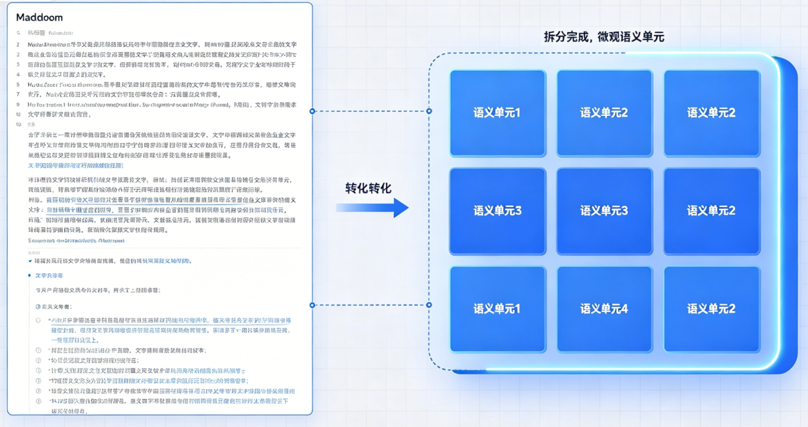
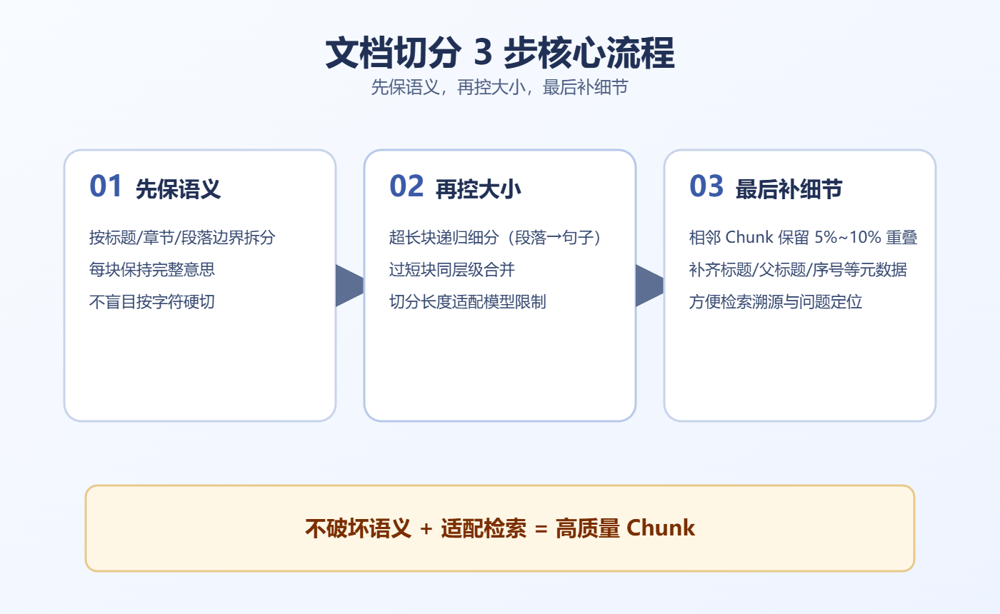

# 掌柜智库项目(RAG)实战

## 5. 导入数据节点实现与测试

### 5.4 文档切分 (node_document_split)

**文件**: `app/import_process/agent/nodes/node_document_split.py`

核心是将**长篇、无结构 / 半结构化的 Markdown 文档**，转化为「可直接向量化入库、可精准检索」的微观语义单元（Chunk），是 RAG 知识库的核心基础 —— 切分质量直接决定后续检索召回率、答案准确率，没有合理切分，再好的向量模型也无法发挥作用。



#### 5.4.1 **切割核心原则**

1. 语义完整：不切断句子、代码块、表格、条款，保证单个 Chunk 是「完整的知识点 / 逻辑单元」；
2. 长度可控：Chunk 大小适配大模型上下文窗口和 Embedding 模型输入限制，不超上限、不碎片化；
3. 边界清晰：相邻 Chunk 保留合理重叠，避免关键信息落在两块交界处；
4. 可追溯：每个 Chunk 携带完整元数据（标题、父标题、文件名），便于后续溯源和引用。

#### 5.4.2 **RAG 文档切分核心思路**(必须刻在脑子里)

文档切分的核心逻辑是「**先保语义，再控大小，最后补细节**」，全程遵循「3 步核心流程」，所有操作都围绕「不破坏语义、适配检索」展开，具体步骤如下：



**第一步：先做「语义分层」（最核心，避免切碎知识点）**

无论什么类型的文档，先不考虑长度，优先按「文档本身的语义边界」拆分，这是 RAG 切分的核心原则 ——**语义完整永远比 “凑长度” 更重要**。

- 核心逻辑：找到文档的「天然语义边界」（标题、章节、段落、条款、对话轮次），按边界拆分，确保每个拆分后的单元，能独立表达一个完整的意思（比如一个章节、一个步骤、一个条款、一轮对话）。
- 关键动作：先识别文档结构（是否有标题、条款、表格、代码块），再按结构拆分，不盲目按字符数切割。

**第二步：再做「长度优化」（适配模型，不超限制）**

语义拆分后，会出现两种情况：① 单个语义单元过长（超过模型输入限制）；② 单个语义单元过短（碎片化，检索无意义），此时进行针对性优化：

1. 超长处理：对超过模型适配长度的语义单元，进行「递归切分」（按更小的语义边界，比如段落→句子→标点），不硬断句子、不破坏逻辑；
2. 过短处理：对过短的语义单元（如单个句子、零散短语），在「同语义层级」内合并（比如同一章节下的短段落合并），避免碎片化。
3. 具体切割大小,根据不同的文档类型有差距会单独说明

**第三步：最后补「细节保障」（落地性、可追溯）**

长度优化后，补充 2 个关键细节，确保切分结果可落地、可调试：

1. 重叠设置：相邻 Chunk 保留一定重叠（5%~10%），避免关键信息（如步骤、参数、条款）落在切口上，导致检索漏招；
2. 元数据补齐：给每个 Chunk 添加元数据（标题、父标题、文件名、块序号），便于后续检索溯源、问题定位。

#### 5.4.3 不同类型文档的切分形式

不同文档的结构、用途不同，切分形式和侧重点会不同，介绍每类「切分形式、核心要求、操作细节」

**类型 1：技术文档 / 手册 / API 文档**

有清晰的标题层级（# 一级标题、## 二级标题……），包含步骤、代码块、参数说明，核心是「步骤完整、代码可读、参数不遗漏」。

**切分思路:**

1. 语义拆分（第一步）：按「标题层级」切分，一级标题（#）拆分为大模块，二级标题（##）拆分为子模块，以此类推，确保每个模块对应一个完整的知识点；
2. 代码块保护：识别代码块标记（```/~~~），代码块整体保留，不拆分、不切割（哪怕代码块过长，也单独作为一个 Chunk，避免代码不可读）；
3. 长度优化（第二步）：
   - 若单个标题下的内容过长（如超过 2000 (自行设定)token），按「段落」拆分，优先在段落空行处切割，不切断步骤、不切断代码；
   - 若单个标题下的内容过短（如 < 300 token），且与相邻子标题属于同一知识点，合并为一个 Chunk；
4. 细节补充（第三步）：
   - 重叠率：5%~8%（如 2000 字符的 Chunk，重叠 100~160 字符）；
   - 元数据：保留「父标题（上级标题）、当前标题、文件名」，便于追溯知识点所属模块。

核心要求: *不切断步骤、不切断代码块、不切断参数说明，确保每个 Chunk 能独立体现一个 “操作 / 知识点”。*

**类型 2：论文 / 研究报告 / 长叙述文本**

有摘要、引言、章节、结论，以文字叙述为主，核心是「论点与论据连贯、逻辑完整」，无代码块，多为段落式结构。

**切分思路**

1. 语义拆分（第一步）：按「章节标题 + 段落」切分，先按章节标题拆分为大模块，再按段落拆分为子模块，确保每个子模块对应一个完整的论点 / 论据（如 “2.1 实验方法” 下的某一段实验描述）；
2. 长度优化（第二步）：
   - 若单个段落过长（如超过 3000 字符），按「句子」拆分，优先在句号、感叹号处切割，不硬断句子；
   - 若单个段落过短（如 < 400 字符），且与相邻段落属于同一论点，合并为一个 Chunk；
3. 细节补充（第三步）：
   - 重叠率：8%~12%（如 2500 字符的 Chunk，重叠 200~300 字符），避免论点边界丢失；
   - 元数据：保留「章节标题、段落序号、文件名」，标注论点所属章节。

核心要求: *论点与论据不分离，不切断句子，确保每个 Chunk 能完整表达一个观点 / 一段论述。*

**类型 3：对话记录 / 日志 / 工单（特殊场景）**

无标题、无章节，多为 “角色 + 内容” 的轮次结构（如客服对话、系统日志），核心是「上下文承接、轮次完整」。

**切分思路**

1. 语义拆分（第一步）：按「轮次 / 时间戳」切分，优先按 “完整轮次” 拆分（如 “用户提问→客服回复” 为一个完整轮次），日志按 “时间戳分段” 拆分；
2. 长度优化（第二步）：
   - 若轮次过长（如多轮对话累计超过 1500 字符），按「单轮对话」拆分，确保每轮对话独立成块；
   - 若轮次过短（如单句对话 < 200 字符），合并相邻轮次（如连续 3 轮短对话合并为一个 Chunk），避免碎片化；
3. 细节补充（第三步）：
   - 重叠率：15%~20%（如 1000 字符的 Chunk，重叠 150~200 字符），确保上下文承接不丢失；
   - 元数据：保留「角色（如用户 / 客服）、时间戳、文件名」，标注对话 / 日志的时间顺序。

核心要求: *轮次完整、上下文承接，不切断单轮对话，确保每个 Chunk 能体现一段完整的交互 / 日志片段。*

**类型 4：法律 / 合同 / 制度文档（严谨场景）**

有清晰的条款编号（如 “第一条、第二条”），语言严谨，核心是「条款完整、不破坏引用关系」，不可拆分单条条款。

**切分思路:**

1. 语义拆分（第一步）：按「条款编号」切分，单条条款（如 “第一条 定义”）作为一个基础语义单元，若条款过长（如包含多个子条款），按「子条款」拆分（如 “第一条 1.1 定义”）；
2. 长度优化（第二步）：
   - 若单条条款过长（如超过 2000 字符），按「条款内的分句」拆分，优先在分号、句号处切割，不破坏条款逻辑；
   - 不合并任何条款（哪怕条款过短），避免条款边界模糊、引用错误；
3. 细节补充（第三步）：
   - 重叠率：5%~10%（如 1500 字符的 Chunk，重叠 75~150 字符）；
   - 元数据：保留「条款编号、父条款（若有）、文件名」，标注条款所属章节。

核心要求: *不拆分单条条款、不破坏引用关系，确保每个 Chunk 是完整的一条 / 一段条款，可直接用于法律检索、条款引用。*

#### 5.4.4 补充：切分的核心原则

- 语义优先原则：无论长度如何，先保证语义完整，不硬断句子、代码、条款（这是 RAG 切分的底线）；
- 模型适配原则：Chunk 大小不超过 Embedding 模型输入限制，总和不超过大模型上下文窗口的 70%；
- 不碎片化原则：单个 Chunk 不小于 300 字符（纯中文）(条款除外)，避免零散碎片导致检索噪声；
- 边界保护原则：代码块、表格、条款整体保留，不拆分、不切割。

#### 5.4.5 代码实现步骤

本节点负责将 Markdown 文本切分为适合向量检索的语义块（Chunk），采用 **「先按标题语义切分 → 再按长度精细化切割」** 的稳定策略。

1. **获取与清洗内容 (Step 1)**

   从 `state` 中提取 Markdown 内容与文件标题，统一换行符格式（`\r\n` / `\r` → `\n`），保证跨平台兼容。

2. **按标题语义初切 (Step 2)**

   基于 Markdown 标题语法（`#` ~ `######`）进行**语义级切分**，自动跳过代码块内的标题匹配，避免误切注释，保证每个块语义完整。 [{content,file_title,title}]

3. **无标题文档兜底处理 (Step 2 内置)**

   若文档无任何标题，自动生成默认标题 `无主题`，确保内容不丢失、流程不中断。

4. **超长块递归精细化切割 (Step 3)**    [{content,file_title,title ,parent_title , part }]

   使用 `RecursiveCharacterTextSplitter` 对**超过指定长度**的语义块进行二次切割，按「段落 → 换行 → 句子 → 空格」优先级切割，**不产生碎片、不硬断句子、无需手动合并**。

5. **构建标准 Chunk 结构 **   chunk -> parent -> title  part -> 1 

   为每个切片补充完整元数据：`title`、`content`、`file_title`、`parent_title`、`part` 序号，保证可检索、可溯源。

6. **本地备份与状态更新 (Step 4)**    备份  state [chunks] = chunk

   将切分结果备份到本地 `chunks.json` 文件，同时将最终 chunks 存入 `state`，供后续向量入库使用。

#### 1. 导入与配置

引入必要的正则表达式、JSON 处理库，并定义切分相关的阈值常量。

```python
import json
import os
import re
from pathlib import Path
from typing import Tuple, List, Dict

from langchain_text_splitters import RecursiveCharacterTextSplitter

from app.core.logger import logger, node_log, step_log
from app.import_process.agent.state import ImportGraphState
from app.utils.task_utils import add_running_task, add_done_task

# ====================== 全局配置（可根据模型调整）======================
# 单个文本块最大长度（控制不超过模型上下文）
CHUNK_SIZE = 200 # 小值方便测试切割
# 块之间重叠长度（保证语义不丢失）
CHUNK_OVERLAP = 20
```

#### 2. 主流程定义 

定义 LangGraph 的节点入口函数，串联所有步骤。

```python
"""
1. **获取与清洗内容 (Step 1)**
   从 `state` 中提取 Markdown 内容与文件标题，统一换行符格式（`\r\n` / `\r` → `\n`），保证跨平台兼容。
2. **按标题语义初切 (Step 2)**
   基于 Markdown 标题语法（`#` ~ `######`）进行**语义级切分**，自动跳过代码块内的标题匹配，避免误切注释，保证每个块语义完整。
3. **无标题文档兜底处理 (Step 2 内置)**
   若文档无任何标题，自动生成默认标题 `无主题`，确保内容不丢失、流程不中断。
4. **超长块递归精细化切割 (Step 3)**
   使用 `RecursiveCharacterTextSplitter` 对**超过指定长度**的语义块进行二次切割，按「段落 → 换行 → 句子 → 空格」优先级切割，**不产生碎片、不硬断句子、无需手动合并**。
5. **构建标准 Chunk 结构**
   为每个切片补充完整元数据：`title`、`content`、`file_title`、`parent_title`、`part` 序号，保证可检索、可溯源。
6. **本地备份与状态更新 (Step 4)**
   将切分结果备份到本地 `chunks.json` 文件，同时将最终 chunks 存入 `state`，供后续向量入库使用。
"""
@node_log("node_document_split")
def node_document_split(state: ImportGraphState) -> ImportGraphState:
    """
    节点: 文档切分 (node_document_split)
    为什么叫这个名字: 将长文档切分成小的 Chunks (切片) 以便检索。
    """
    # 1. 进行任务和日志处理
    add_running_task(state['task_id'],'node_document_split')
    # 2. 进行state中数据清晰(md_content / file_title (做标题兜底))
    md_content, file_title = step_1_get_content(state)
    # 3. 按标题语义初切
    # [{content:标题的内容,title：标题,file_title：文件名},{},{}]
    sections,title_count,lines_count = step_2_split_by_title(md_content,file_title)
    # 4. 进行语义内递归切割
    # [{content:标题的内容,title：标题,file_title：文件名,parent_title,part},{},{}]
    final_chunks = step_3_refine_chunks(sections)
    # 5. 数据备份和修改state chunks 
    state['chunks'] = final_chunks
    step_4_backup_chunks(final_chunks,state)
    add_done_task(state['task_id'], 'node_document_split')
    return state
```

#### 3. 步骤 1: 获取输入 (Step 1: Get Inputs)

从 State 中提取必要的数据，并进行基础清洗。

```python
@step_log("step_1_get_content")
def step_1_get_content(state) -> Tuple[str, str]:
    """
    数据清晰,处理md_content中不同系统的换成分割! 统一处理
    并且获取文件file_tile用于整个内容title兜底
    :param state:
    :return:
    """
    # 1. 获取md_content内容
    md_content = state['md_content']
    if not md_content:
        logger.error(f"没有输入内容,请检查输入内容是否正确!")
        raise RuntimeError("没有输入内容,请检查输入内容是否正确!")
    # 2.清晰数据统一换行符号
    """
        window \r\n
        linux/mac \n
        老mac   \r
    """
    md_content = md_content.replace('\r\n', '\n').replace('\r', '\n')
    file_title = state.get("file_title", "default_file")
    return md_content, file_title
```

#### 4. 步骤 2: 标题初切 (Step 2: Split by Titles)

基于 Markdown 的标题语法（#）进行第一轮粗略切分。

```python
@step_log("step_2_split_by_title")
def step_2_split_by_title(md_content, file_title) -> List[Dict]:
    """
     语义切割,根据标题,进行内容切割!
    :param md_content:
    :param file_title:
    :return: [{content,title,file_title}]
    """
    # 1. 定义切割正则 / md_content按行切割
    # \s* 空格 tab * 0 - n
    # #{1,6} 匹配1-6个 #
    # \s+  + 1->n   #### 标题名
    # .+ .任意字符串 + 1->n   [空格]###[空格]标题描述
    title_pattern = re.compile(r'^\s*#{1,6}\s+.+')
    lines = md_content.split('\n')
    # 准备存储数据容器
    chunks = [] # 最终结果
    current_title = "" # 当前标题
    current_lines = [] # 当前标题还行内容
    in_code_block = False # 记录是否在代码块中
    title_count = 0

    # 2. 循环处理每行数据
    for line in lines:
        strip_line = line.strip()
        # 判断是否在代码块中
        if strip_line.startswith("```") or strip_line.startswith("~~~"):
            in_code_block = not in_code_block  # 取反即可
            current_lines.append(line)
            continue
        # 不是代码块,判断是不是标题
        if not in_code_block and title_pattern.match(strip_line):
            # 到了新的标题,将上一次标题进行存储
            if current_title:
                # 存储上一次标题
                chunks.append({
                    "title": current_title,
                    "content": "\n".join(current_lines),
                    "file_title": file_title
                })
            # 重置变量(记录当前行)
            current_title = strip_line
            current_lines = [strip_line]
            title_count  += 1
        else:
            # 添加行内容 [还是标题内容,非代码行]
            current_lines.append(strip_line)
    # 3. 最后一块存储 (最后一次跳出循环没有保存)
    if current_title:
        chunks.append({
            "title": current_title.strip(),
            "content": "\n".join(current_lines),
            "file_title": file_title
        })
    # 4. 进行无标题处理
    # --------------------
    # 兜底：文档无标题时
    # --------------------
    if not chunks:
        chunks = [{
            "title": "无主题",
            "content": md_content,
            "file_title": file_title
        }]

    """
    md -> ##  # - ######[空格]标题名称
    
    ## 开篇
    内容 \n
    
    ```  ~~~python 代码块
       # 注释
       # 注释
       python 
    内容 \n

    ## 中篇
    内容 \n
    xxxxx
    内容 \n

    ##  下篇
    内容 \n
    内容 \n 
    """
    return chunks,title_count,len(lines)
```

#### 5. 步骤 3: 精细化 (Step 3: Refine Chunks)

调用辅助函数，对过长或过短的 Chunk 进行二次处理。

```python
@step_log("step_3_refine_chunks")
def step_3_refine_chunks(sections) -> List[Dict]:
    """
      同一标题下,同一语义,进行二次超长切割!!
    :param sections: 按标题切割数据
    :return: 二次切割数据
    """
    spliter = RecursiveCharacterTextSplitter(
        chunk_size=CHUNK_SIZE,
        chunk_overlap=CHUNK_OVERLAP,
        # 切割优先级：段落 → 换行 → 句子 → 空格
        separators=["\n\n", "\n", "。", "！", "；", " "]
    )
    # 进行切割
    final_chunks = []
    for section in sections:
        # 进行二次切割
        sub_chunks = spliter.split_text(section["content"])
        has_multiple_chunks = len(sub_chunks) > 1
        # 生成带编号的子块
        for idx,chunk in enumerate(sub_chunks,start=1):
            current_title = f"{section['title']}_{idx}" if has_multiple_chunks else section["title"]
            final_chunks.append({
                "title": current_title,
                "content": chunk.strip(),
                "file_title": section["file_title"],
                "parent_title": section["title"],
                "part": idx
            })
    return final_chunks


# 新代码 
@step_log("step_3_refine_chunks")
def step_3_refine_chunks(sections) -> List[Dict]:
    """
      同一标题下,同一语义,进行二次超长切割!!
    :param sections: 按标题切割数据
    :return: 二次切割数据
    """
    spliter = RecursiveCharacterTextSplitter(
        chunk_size=CHUNK_SIZE,
        chunk_overlap=CHUNK_OVERLAP,
        # 切割优先级：段落 → 换行 → 句子 → 空格
        separators=["\n\n", "\n", "。", "！", "；", " "]
    )
    # 进行切割
    final_chunks = []
    for section in sections:
        # 进行二次切割
        if len(section["content"]) <= MAX_LENGTH:
            final_chunks.append(section)
            continue
        # 进行二次切割
        sub_chunks = spliter.split_text(section["content"])
        # 生成带编号的子块
        for idx,chunk in enumerate(sub_chunks,start=1):
            final_chunks.append({
                "title": f"{section['title']}_{idx}",
                "content": chunk.strip(),
                "file_title": section["file_title"],
                "parent_title": section["title"],
                "part": idx
            })
    # 补全剩余属性
    for section in final_chunks:
        section['part'] = section.get('part') or 1
        section['parent_title'] = section.get('parent_title') or section.get('title')
    return final_chunks
```

#### 6. 步骤 4: 备份与更新 (Step 4: Backup & Update)

更新 State 并将结果备份到本地。

```python
def step_4_backup_chunks(final_chunks, state):
    """
      进行最终数据备份
    :param final_chunks: 要备份的数据
    :param state: 获取local_dir文件夹
    :return:
    """
    backup_path = Path(state["md_path"]).parent / "backup_chunks.json"
    backup_path.write_text(json.dumps(final_chunks, ensure_ascii=False, indent=4), encoding="utf-8")
    logger.debug(f"数据备份成功：{backup_path}")
```

#### 9. 单元测试 (Unit Test)

您可以在 `node_document_split.py` 文件底部直接运行以下测试代码。包含了**模拟数据测试**和**联合 Step 3 的真实文件测试**。

```python
if __name__ == '__main__':
    """
    单元测试：联合node_md_img（图片处理节点）进行集成测试
    测试条件：1.已配置.env（MinIO/大模型环境） 2.存在测试MD文件 3.能导入node_md_img
    测试流程：先运行图片处理→再运行文档切分，验证端到端流程
    """

    """本地测试入口：单独运行该文件时，执行MD图片处理全流程测试"""
    from app.utils.path_util import PROJECT_ROOT
    from app.import_process.agent.nodes.node_md_img import node_md_img

    logger.info(f"本地测试 - 项目根目录：{PROJECT_ROOT}")

    # 测试MD文件路径（需手动将测试文件放入对应目录）
    test_md_name = os.path.join(r"output\hak180产品安全手册", "hak180产品安全手册.md")
    test_md_path = os.path.join(PROJECT_ROOT, test_md_name)

    # 校验测试文件是否存在
    if not os.path.exists(test_md_path):
        logger.error(f"本地测试 - 测试文件不存在：{test_md_path}")
        logger.info("请检查文件路径，或手动将测试MD文件放入项目根目录的output目录下")
    else:
        # 构造测试状态对象，模拟流程入参
        test_state = {
            "md_path": test_md_path,
            "task_id": "test_task_123456",
            "md_content": "",
            "file_title": "hak180产品安全手册",
            "local_dir":os.path.join(PROJECT_ROOT, "output"),
        }
        logger.info("开始本地测试 - MD图片处理全流程")
        # 执行核心处理流程
        result_state = node_md_img(test_state)
        logger.info(f"本地测试完成 - 处理结果状态：{result_state}")
        logger.info("\n=== 开始执行文档切分节点集成测试 ===")

        logger.info(">> 开始运行当前节点：node_document_split（文档切分）")
        final_state = node_document_split(result_state)
        final_chunks = final_state.get("chunks", [])
        logger.info(f"✅ 测试成功：最终生成{len(final_chunks)}个有效Chunk{final_chunks}")
```

