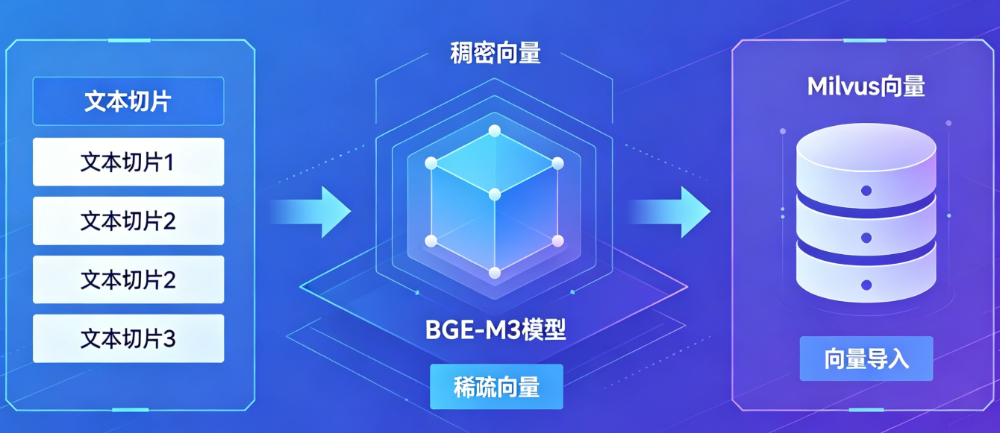

# 掌柜智库项目(RAG)实战

## 5. 导入数据节点实现与测试

### 5.6 向量化 (node_bge_embedding)

**文件**: `app/import_process/agent/nodes/node_bge_embedding.py`
**相关工具类位置**: `app/lm/embedding_utils.py`

本章节讲解**RAG 知识库构建中最核心、最底层的技术环节：文本切片向量化**。

在文档完成切分、主体识别后，必须将人类可读的文本，转化为机器可理解的**高维向量**，才能存入向量库、实现语义检索。

#### 节点作用与实现思路

本节点是**RAG 知识库从 “文本” 走向 “可检索” 的核心桥梁**，负责将预处理完成的文本切片（Chunk）转化为机器可计算、可存储、可匹配的向量表示。

通过**BGE‑M3 多粒度向量模型**，**同时生成稠密向量（Dense）与稀疏向量（Sparse）**，为系统提供**混合检索能力**—— 既支持语义理解式模糊匹配，也支持关键词级精准匹配，大幅提升知识库召回率、准确率与鲁棒性，是整个 RAG 架构中**决定检索质量的关键底层模块**。



**实现思路**:

1.  **双向量同步编码**

    依托 BGE‑M3 模型特性，**一次推理同时输出稠密向量与稀疏向量**，稠密向量负责捕获深层语义相似度，稀疏向量负责关键词与实体精准匹配，实现 “语义 + 关键词” 双驱动检索。
2.  **核心主体增强**

    采用**item_name（主体）+ content（切片内容）** 拼接策略，将核心实体前置强化，让向量更聚焦业务主体，显著提升实体级检索精度。

3. **批处理高效计算**

   采用分批向量化模式，避免大批次文本导致显存溢出，提升 GPU/CPU 利用率，保证大规模文档导入时的稳定性与效率。

4. **工程化鲁棒保障**

   全流程异常隔离、单批次失败不影响整体、向量自动归一化、输入严格校验，确保向量化流程稳定不中断、数据不丢失、结果无偏差。

#### 1. 导入与配置 

引入必要的依赖库，配置 BGE-M3 向量化流程。

```python
import os
from typing import Any, List, Dict

from app.import_process.agent.state import ImportGraphState
from app.lm.embedding_utils import get_bge_m3_ef, generate_embeddings
from app.utils.task_utils import add_running_task,add_done_task
from app.core.logger import logger,node_log,step_log
```

#### 2. 主流程定义 

定义 `node_bge_embedding` 函数，串联各个步骤。

```python
"""
 1. 输入校验：验证chunks有效性，核心数据缺失则终止当前节点
 2. 模型初始化：获取BGE-M3单例模型实例，避免重复加载
 3. 批量向量化：分批拼接文本、生成双向量，为切片绑定向量字段
 4. 状态更新：将带向量的chunks更新回全局状态，供下游Milvus入库节点使用
"""
@node_log("node_bge_embedding")
def node_bge_embedding(state: ImportGraphState) -> ImportGraphState:
    """
    节点: 向量化 (node_bge_embedding)
    为什么叫这个名字: 使用 BGE-M3 模型将文本转换为向量 (Embedding)。
    """
    # 日志和任务队列处理
    add_running_task(state['task_id'], "node_bge_embedding")
    # 步骤1：输入数据校验，核心chunks无效则抛出异常
    texts_to_embed = step_1_validate_input(state)
    # 步骤2：初始化BGE-M3模型（单例模式，仅加载一次）
    bge_m3_ef = step_2_init_model()
    # 步骤3：批量生成双向量，为切片绑定向量字段
    output_data = step_3_generate_embeddings(texts_to_embed, bge_m3_ef)
    # 步骤4: 输出数据处理
    state['chunks'] = output_data
    add_done_task(state['task_id'], "node_bge_embedding")
    return state
```

#### 4. 步骤 1: 校验输入

检查输入数据是否有效。

```python
@step_log("step_1_validate_input")
def step_1_validate_input(state: ImportGraphState) -> List[Dict[str, Any]]:
    """
    向量化前置步骤1：输入数据有效性校验
    核心作用：
        1. 从全局状态提取待向量化的chunks切片列表
        2. 严格校验chunks类型和非空性，无有效数据则终止向量化
    """
    # 从状态中提取切片数据
    texts_to_embed = state.get("chunks")
    # 校验：必须是非空列表，否则无法进行向量化
    if not isinstance(texts_to_embed, list) or not texts_to_embed:
        logger.error("向量化输入校验失败：chunks字段为空或非有效列表")
        raise ValueError("错误: 无有效文本切片数据，无法执行向量化处理")

    logger.info(f"向量化输入校验通过，待处理文本切片数量：{len(texts_to_embed)}")
    return texts_to_embed
```

#### 5. 步骤 2: 初始化模型

加载 BGE-M3 模型客户端。（可以忽略）

```python
@step_log("step_2_init_model")
def step_2_init_model():
    """
    向量化步骤2：初始化BGE-M3模型实例（单例模式）
    核心作用：
        1. 调用单例函数get_bge_m3_ef，确保模型全局仅加载一次
        2. 校验模型实例有效性，加载失败则抛出明确异常
    返回：
        Any - 有效BGE-M3模型实例（embedding function）
    异常：
        模型加载失败（路径错误/显存不足/依赖缺失）时，抛出ValueError并提示配置问题
    """
    try:
        # 获取单例模型实例，避免重复加载浪费资源
        ef = get_bge_m3_ef()
        # 校验模型实例是否有效
        if ef is None:
            raise ValueError("BGE-M3模型实例为None：pymilvus.model模块未找到或模型加载失败")

        logger.info("BGE-M3模型实例初始化成功（单例模式）")
        return ef
    except Exception as e:
        # 包装异常信息，明确错误原因和排查方向
        error_msg = f"BGE-M3模型初始化失败：{e}，请检查模型路径/环境变量配置是否正确"
        logger.error(error_msg)
        raise ValueError(error_msg)
```

#### 6. 步骤 3: 批量生成向量

分批次为文本生成稠密和稀疏向量，并进行归一化处理。

```python
@step_log("step_3_generate_embeddings")
def step_3_generate_embeddings(texts_to_embed, bge_m3_ef) -> List[Dict[str, Any]]:
    """
    批量进行向量生成! 返回稠密和稀疏双向量
    核心逻辑(分批执行,每批独立异常处理)
       1. 文本拼接: item_name + 换行 + content , 强化核心特征
       2. 批量调用: 传入拼接后的文本,生成批量双向量
       3. 向量绑定: 为每个切片复制原数据.新增dense_vector和sparse_vector字段
       4. 异常兜底,每批次发生异常不影响全局处理
    :param texts_to_embed:  texts_to_embed: List[Dict[str, Any]] - 校验通过的文本切片列表，含item_name/content字段
    :param bge_m3_ef: bge_m3_ef: Any - 步骤2初始化的BGE-M3模型实例
    :return:  List[Dict[str, Any]] - 带向量字段的文本切片列表，异常批次保留原数据
    batch_size: 每批处理5条，可根据服务器显存大小调整（显存大则调大，反之调小）
    """
    # 初始化结果列表,存储带有向量的chunk数据
    output_data = []
    # 定义批量大小: 根据显存 + 嵌入式模型的窗口大小进行动态条件
    batch_size = 5
    total =len(texts_to_embed)
    # 循环进行批量处理(使用循环步长)
    for i in range(0, total, batch_size):
        # 截取当前批次的切片，最后一批自动适配剩余数量【每次获取5个】
        batch_texts = texts_to_embed[i:i + batch_size]
        # 使用异常捕捉进行批量处理
        try:
            # 构造模型输入文本：拼接商品名+切片内容，增强核心特征
            input_texts = []
            # 构建模型输入文本: item_name + 换行 + content 拼接, 强化核心特征(chunk都明确item_name)
            for chunk in batch_texts:
                item_name = chunk["item_name"]
                content = chunk["content"]
                # 有商品名则拼接（换行分隔提升模型识别效率），无则直接使用内容
                # 几乎所有的 Embedding 模型（尤其是基于 BERT 架构的），对前 128 个 token 的注意力是最集中的。越往后的词，对最终向量方向的拉扯力越弱。
                # **“核心词前置”**的原则
                # 方案 1：用强标点代替换行（最简单、最推荐）
                # 优化前：苹果手机\n性能很好...
                # 优化后：苹果手机。性能很好...
                # 方案2：加一点“微量”的语义胶水（适合属性明确的场景）
                text = f"商品：{item_name}，介绍：{content}" if item_name else content
                # Embedding 模型是个强迫症，你给它喂中文，就用全套中文标点伺候；给它喂英文，就用全套英文标点。保持 语境纯粹 ，生成的向量质量最高！
                input_texts.append(text)

            # 调用封装函数生成批量向量，返回格式：{"dense": [稠密向量列表], "sparse": [稀疏向量列表]}
            docs_embeddings = generate_embeddings(input_texts)
            if not docs_embeddings:
                logger.error("向量化结果为空：请检查输入文本是否为空")
                output_data.extend(batch_texts)
            # 为当前批次每个切片绑定对应向量，复制原数据避免修改上游源数据
            for j, doc in enumerate(batch_texts):
                item = doc.copy()
                item["dense_vector"] = docs_embeddings["dense"][j]  # 绑定稠密向量
                item["sparse_vector"] = docs_embeddings["sparse"][j]  # 绑定稀疏向量（已归一化）
                output_data.append(item)

        except Exception as e:
            # 捕获异常，记录错误信息并跳过当前批次
            logger.error(f"向量化批次处理异常：{e}")
            # 异常批次保留原切片数据，保证数据完整性，后续可人工排查
            output_data.extend(batch_texts)
            # 跳过当前批次，继续处理下一批次
            continue
    return output_data
```

#### 7. 单元测试

您可以在 `node_bge_embedding.py` 文件底部直接运行以下测试代码：

```python
# ==========================================
# 本地单元测试入口
# 功能：独立验证向量化节点全链路逻辑，无需启动整个LangGraph流程
# 适用场景：本地开发、调试、模型有效性验证
# ==========================================
if __name__ == '__main__':
    # 加载环境变量：定位项目根目录下的.env，读取模型路径/设备等配置
    current_dir = os.path.dirname(os.path.abspath(__file__))
    project_root = os.path.dirname(os.path.dirname(current_dir))
    load_dotenv(os.path.join(project_root, ".env"))

    # 构造模拟测试状态：模拟上游节点输出的chunks数据，贴合真实业务场景
    test_state = ImportGraphState({
        "task_id": "test_task_embedding_001",  # 测试任务ID
        "chunks": [  # 模拟带item_name的文本切片（上游商品名称识别节点产出）
            {
                "content": "这是一个测试文档的内容，用于验证向量化是否成功。",
                "title": "测试文档标题",
                "item_name": "测试项目",
                "file_title": "测试文件.pdf"
            },
            {
                "content": "这是第二个测试文档的内容，用于验证批量处理逻辑。",
                "title": "测试文档标题2",
                "item_name": "测试项目",
                "file_title": "测试文件.pdf"
            }
        ]
    })

    # 执行本地测试
    logger.info("=== BGE-M3向量化节点本地单元测试启动 ===")
    try:
        # 调用核心节点函数
        result_state = node_bge_embedding(test_state)
        # 提取测试结果
        result_chunks = result_state.get("chunks", [])

        # 打印测试结果统计
        logger.info(f"=== 向量化节点本地测试完成 ===")
        logger.info(f"测试任务ID：{test_state.get('task_id')}")
        logger.info(f"待处理切片数：2 | 实际处理切片数：{len(result_chunks)}")

        # 验证向量生成结果（打印向量字段是否存在）
        for idx, chunk in enumerate(result_chunks):
            has_dense = "dense_vector" in chunk
            has_sparse = "sparse_vector" in chunk
            logger.info(
                f"第{idx + 1}条切片：稠密向量生成{'' if has_dense else '未'}成功 | 稀疏向量生成{'' if has_sparse else '未'}成功")

    except Exception as e:
        logger.error(f"=== 向量化节点本地测试失败 ===" f"错误原因：{str(e)}", exc_info=True)
        # 新手友好提示：给出核心排查方向
        logger.warning("排查提示：请检查BGE-M3模型路径、显存是否充足、环境变量配置是否正确")
```

