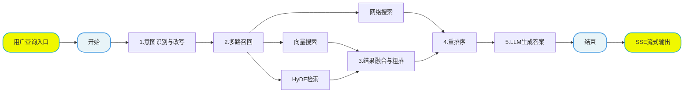

# 掌柜智库项目(RAG)实战

## 7. 检索数据图与状态定义

### 7.1 定义状态 (State)

所有节点共享同一个状态对象。我们需要定义它来存储处理过程中的数据（如 查询原始问题、改写问题、历史对话、不同方向切片结果等）。



**文件**: `app/query_process/agent/state.py`

```python
from typing_extensions import TypedDict
from typing import List
import copy

class QueryGraphState(TypedDict):
    """
    QueryGraphState 定义了整个查询流程中流转的数据结构。
    """
    session_id: str  # 会话唯一标识
    original_query: str  # 用户原始问题

    # 检索过程中的中间数据
    embedding_chunks: list  # 普通向量检索回来的切片
    hyde_embedding_chunks: list  # HyDE 检索回来的切片
    web_search_docs: list  # 网络搜索回来的文档

    # 排序过程中的数据
    rrf_chunks: list  # RRF 融合排序后的切片
    reranked_docs: list  # 重排序后的最终 Top-K 文档

    # 生成过程中的数据
    prompt: str  # 组装好的 Prompt
    answer: str  # 最终生成的答案

    # 辅助信息
    item_names: List[str]  # 提取出的商品名称
    rewritten_query: str  # 改写后的问题
    history: list  # 历史对话记录
    is_stream: bool  # 是否流式输出标记


# ========================
# 默认状态（全部为空）
# ========================
query_graph_default_state: QueryGraphState = {
    "session_id": "",
    "original_query": "",
    "embedding_chunks": [],
    "hyde_embedding_chunks": [],
    "web_search_docs": [],
    "rrf_chunks": [],
    "reranked_docs": [],
    "prompt": "",
    "answer": "",
    "item_names": [],
    "rewritten_query": "",
    "history": [],
    "is_stream": False
}


# ========================
# 创建默认状态（可覆盖）
# ========================
def create_query_default_state(**overrides) -> QueryGraphState:
    """
    创建查询流程的默认状态，支持覆盖字段
    """
    state = copy.deepcopy(query_graph_default_state)
    state.update(overrides)
    return state


# ========================
# 获取干净状态
# ========================
def get_query_default_state() -> QueryGraphState:
    return copy.deepcopy(query_graph_default_state)


# ========================
# ✅ 状态复制函数（你要的）
# ========================
def copy_query_state(state: QueryGraphState, **overrides) -> QueryGraphState:
    """
    复制现有状态并可覆盖字段，深拷贝，不污染原数据
    """
    new_state = copy.deepcopy(state)
    new_state.update(overrides)
    return new_state


if __name__ == "__main__":
    # 测试
    state = create_query_default_state(
        session_id="test_001",
        original_query="华为P60怎么样?",
        is_stream=False
    )
    print("初始化状态：", state)

    # 复制状态
    new_state = copy_query_state(
        state,
        original_query="修改后的问题"
    )
    print("复制后的状态：", new_state)
```

### 7.2 定义主图 

为了确保整体流程设计的科学性与执行连贯性，我们采用 **"Top-Down"（自顶向下）** 的开发模式，以 “总指挥部” 的全局视角统筹推进，具体实施步骤如下：

1. **搭建节点骨架（Stubs）**：优先定义全流程所需的所有功能节点，仅保留核心日志打印能力（如节点进入 / 退出日志），暂不实现内部复杂业务逻辑，快速搭建起流程的 “骨架结构”；
2. **串联主图（Graph）**：基于预设的业务流转规则，编写主图逻辑将所有节点骨架按序串联，明确节点间的输入输出关系、分支判断条件（如文件格式分流逻辑），形成完整的流程链路；
3. **验证流程通畅性**：启动端到端测试，验证节点间的调用链路是否通顺、数据流转是否符合预期、分支跳转是否准确，确保流程无阻塞、无逻辑漏洞；
4. **填充节点核心逻辑**：在流程链路验证通过后，再逐一聚焦每个节点的内部实现，完成复杂业务逻辑的开发（如 查询重写、定向查询、结果重排处理等），实现 “骨架” 到 “完整系统” 的落地。

该模式的核心优势在于：先保障 “流程走得通”，再聚焦 “功能做得好”，避免因局部逻辑复杂导致整体流程设计偏差，大幅提升开发效率与流程稳定性。

#### 7.2.1 第一步：创建节点骨架

我们需要先创建以下 8 个文件，每个文件里只写一个最简单的“空函数”，确保主图能导入它们。
**请在 `app/query_process/agent/nodes` 目录下创建以下文件，并将对应代码复制进去。**

**(1) 意图确认: `node_item_name_confirm.py`**

这个节点主要干了 4 件事：

1. 提取与改写 ：结合历史对话提取商品名，并将模糊问题改写为完整独立的精准问题。
2. 向量化检索 ：将提取出的商品名在 Milvus 向量库中进行混合搜索。
3. 标准化对齐 ：根据评分高低自动对齐标准型号，或生成反问让用户手动确认。
4. 同步历史记录 ：将改写后的问题、确认的商品名和处理状态实时写入 MongoDB 数据库。

```python
import time
import sys

from app.utils.task_utils import add_running_task, add_done_task


def node_item_name_confirm(state):
    """
    节点功能：确认用户问题中的核心商品名称。
    输入：state['original_query']
    输出：更新 state['item_names']
    """
    print(f"---node_item_name_confirm---开始处理")
    # 记录任务开始
    add_running_task(state["session_id"], sys._getframe().f_code.co_name,state["is_stream"])

    # 后面会调用大模型，进行逻辑处理
    time.sleep(1)
    # 记录任务结束
    add_done_task(state["session_id"], sys._getframe().f_code.co_name,state["is_stream"])

    print(f"---node_item_name_confirm---处理结束")

    return {"item_names": ["示例商品"]}
```

**(2) 向量检索: `node_search_embedding.py`**

这个节点 node_search_embedding 负责根据 改写后的用户问题 ，在 限定的商品范围内 ，利用 BGEM3 混合检索（稠密+稀疏） 技术，从 Milvus 向量数据库中召回 Top5 最相关的知识切片。

```python
import time
import sys
from app.utils.task_utils import  add_done_task,add_running_task

def node_search_embedding(state):
    """
    节点功能：进行向量内容检索
    """
    print("---量内容检索 开始处理---")
    add_running_task(state["session_id"], sys._getframe().f_code.co_name, state.get("is_stream"))

    # 搜索假设性答案
    print("量内容检索答案！！")
    time.sleep(1)

    # ...
    add_done_task(state["session_id"], sys._getframe().f_code.co_name, state.get("is_stream"))

    print("---量内容检索 处理结束---")
    return state
```

**(3) HyDE 假设检索节点: `node_search_embedding_hyde.py`**

这个节点 node_search_embedding_hyde 实现了 HyDE (Hypothetical Document Embeddings) 策略，核心逻辑是 先让 LLM 虚构一个“理想答案”，再用这个答案去向量库检索真实的文档 。

一句话总结： 它通过“LLM 生成假设性答案”来增强原始问题的语义信息，再进行混合向量检索，从而大幅提升对“语义匹配但字面不匹配”问题的召回能力。

```python
import time
import sys
from app.utils.task_utils import  add_done_task,add_running_task

def node_search_embedding_hyde(state):
    """
    节点功能：HyDE (Hypothetical Document Embedding)
    先让 LLM 生成假设性答案，再对答案进行向量检索，提高召回率。
    """
    print("---HyDE 开始处理---")
    add_running_task(state["session_id"], sys._getframe().f_code.co_name, state.get("is_stream"))

    # 搜索假设性答案
    print("搜索架设性答案！！")
    time.sleep(1)

    # ...
    add_done_task(state["session_id"], sys._getframe().f_code.co_name, state.get("is_stream"))

    print("---HyDE 处理结束---")
    return state
```

**(4) 网络搜索节点: `node_web_search_mcp.py`**

这个节点 node_web_search_mcp 负责调用 百炼 MCP (Model Context Protocol) 联网搜索服务 ，获取互联网上的实时信息。

一句话总结： 它通过 MCP 协议异步调用百炼联网搜索接口，将用户的查询转化为实时的、结构化的网络搜索结果（包含标题、链接和摘要）。

```python
import time
import sys
from app.utils.task_utils import add_done_task,add_running_task

def node_web_search_mcp(state):
    """
    节点功能，调用外部搜索引擎补充信息
    :param state:
    :return:
    """
    add_running_task(state["session_id"], sys._getframe().f_code.co_name,state["is_stream"])
    print("---node-web-search-mcp处理---")

    add_done_task(state["session_id"],sys._getframe().f_code.co_name,state["is_stream"])
    time.sleep(1)
    # 调用mcp外部引擎
    print(f"调用外部mcp引擎")

    print("---node-web-search-mcp处理结束---")
    return state
```

**(5) 倒排融合排序节点: `node_rrf.py`**

这个节点 node_rrf 负责 将来自不同检索源（如向量检索、HyDE 检索等）的文档列表进行统一合并和重新排序 。它消除了不同检索方式的分数差异，给出一个综合排名最高的文档列表（Top 10）。

什么是 RRF (Reciprocal Rank Fusion, 倒排排序融合)？

RRF 是一种 不需要知道具体分数，只关心排名 的融合算法。

通俗解释： 假设你在参加一场全能比赛：

- 裁判 A（向量检索） 觉得你是第 1 名。
- 裁判 B（HyDE 检索） 觉得你是第 3 名。
- 裁判 C（关键字检索） 觉得你是第 10 名。

RRF 不管裁判打具体多少分（因为不同裁判打分标准不同，有的满分100，有的满分10），它只看 排名 。

计算公式：


- rank 是你在某个裁判那里的排名（第1名就是1，第2名就是2）。
- k 是一个常数（通常取 60），用来防止排名靠前的差距过大。

RRF 的核心思想：

- 奖励多面手 ：如果你在多个榜单上都排在前面，你的总分就会很高。
- 平滑差异 ：即使你在某个榜单上稍微落后，只要其他榜单表现好，总分依然能上去。
- 去重 ：同一个文档在不同榜单出现多次，RRF 会把它合并，只算一次总分。

举个栗子：假设我们有两个检索来源：

1. 来源 A (向量检索) 找出了前 3 名：

   - 第 1 名： 文档 X
   - 第 2 名： 文档 Y
   - 第 3 名： 文档 Z
2. 来源 B (HyDE 检索) 找出了前 3 名：

   - 第 1 名： 文档 Y (注意：它觉得 Y 比 X 好)
   - 第 2 名： 文档 Z
   - 第 3 名： 文档 W (新面孔)

我们来算一下每个文档的总分：

1. 文档 X

* 在 A 中排第 1 → 得分 = 1 / (60 + 1) = 0.0164

- 在 B 中没出现 → 得分 = 0
- 总分 = 0.0164 + 0 = 0.0164

2. 文档 Y (重点看这个！)

- 在 A 中排第 2 → 得分 = 1 / (60 + 2) = 0.0161
- 在 B 中排第 1 → 得分 = 1 / (60 + 1) = 0.0164
- 总分 = 0.0161 + 0.0164 = 0.0325

3. 文档 Z

- 在 A 中排第 3 → 得分 = 1 / (60 + 3) = 0.0159
- 在 B 中排第 2 → 得分 = 1 / (60 + 2) = 0.0161
- 总分 = 0.0159 + 0.0161 = 0.0320

4. 文档 W

- 在 A 中没出现 → 得分 = 0
- 在 B 中排第 3 → 得分 = 1 / (60 + 3) = 0.0159
- 总分 = 0 + 0.0159 = 0.0159

最终排名结果：

1. 第一名：文档 Y (0.0325) (虽然在 A 排第二，但在 B 排第一，综合实力最强)
2. 第二名：文档 Z (0.0320) (两个榜单都上榜，表现稳定)
3. 第三名：文档 X (0.0164) (偏科，只在 A 表现好)
4. 第四名：文档 W (0.0159)

总结： RRF 就是通过这种方式，让 “在多个榜单都靠前” 的文档排到最前面，比单看某一个榜单更靠谱！

```python
import time
import sys
from app.utils.task_utils import add_running_task, add_done_task

def node_rrf(state):
    """
    节点功能：Reciprocal Rank Fusion
    将多路召回的结果（向量、HyDE、Web、KG）进行加权融合排序。
    """
    print("---RRF---")
    add_running_task(state["session_id"], sys._getframe().f_code.co_name, state.get("is_stream"))
    time.sleep(1)
    # ...
    add_done_task(state['session_id'], sys._getframe().f_code.co_name, state.get("is_stream"))
    return state
```

**(6) 重排序节点: `node_rerank.py`**

这个节点 node_rerank 是知识库检索的“精修师”，它对之前所有步骤召回的文档进行 二次精细排序 。

核心流程分为三步：

1. 合并文档 ：将来自 RRF（本地检索）和 Web Search（联网搜索）的文档合并到一个池子中。
2. 精确打分 ：使用重排序模型计算每个文档与用户问题的相关性得分。
3. 动态截断 ：根据得分的“断崖式下跌”点，智能截取 TopK（最多 10 条），只保留高质量结果，过滤凑数的低分文档。

该节点使用的是 BGE Reranker (BAAI/bge-reranker-large) 模型。

- 模型类型 ：Cross-Encoder（交叉编码器）。
- 工作原理 ：它不像向量检索那样分别计算向量再比对，而是直接把“问题”和“文档”拼接在一起扔给模型，让模型像阅读理解一样，深入分析两者的语义匹配度。
- 特点 ：
  - 精度极高 ：能识别微小的语义差异（如“苹果手机”和“苹果公司”的区别）。
  - 速度较慢 ：因为计算量大，所以通常只用于对初筛后的少量文档（如 Top 20-50）进行精排，不适合全库检索。

```python
import time
import sys
from app.utils.task_utils import add_running_task, add_done_task

def node_rerank(state):
    """
    节点功能：使用 Cross-Encoder 模型对 RRF 后的结果进行精确打分重排。
    """
    print("---Rerank处理---")
    add_running_task(state["session_id"], sys._getframe().f_code.co_name, state.get("is_stream"))

    time.sleep(1)
    # ...
    add_done_task(state['session_id'], sys._getframe().f_code.co_name, state.get("is_stream"))
    return state
```

**(7) 答案生成: `node_answer_output.py`**

这个节点 node_answer_output 是知识库查询的“最后一公里”，负责 生成最终回答 并 交付给用户 。

它整合了之前所有步骤的成果，通过以下 5 个核心动作完成任务：

1. 检查前置答案 ：如果之前步骤（如商品名确认节点）已经生成了追问或拒绝回答，直接输出，跳过 LLM 生成。
2. 构建 Prompt ：将用户问题、历史对话、以及 Rerank 后的 TopK 高质量文档片段（包含元数据）组装成一段严谨的提示词。
3. LLM 生成与流式推送 ：调用大模型生成最终答案。如果是流式模式，会**逐字推送（Delta）**给前端，实现打字机效果。
4. 图片提取与增强 ：从引用文档中自动提取图片 URL（包括网页链接和本地 Markdown 图片），为纯文本答案补充视觉信息。
5. 收尾与存档 ：将最终答案和提取的图片写入 MongoDB 历史记录，并向前端发送包含完整信息（答案+图片）的 FINAL 信号 。

```python
import time
import sys
from app.core.logger import logger
from app.utils.sse_utils import push_to_session, SSEEvent
from app.utils.task_utils import add_running_task, add_done_task

def node_answer_output(state):
    """
    节点功能：进行过处理可以是流式输出可以整体输出！
    """
    print("---node_answer_output 节点处理开始---")
    add_running_task(state["session_id"], sys._getframe().f_code.co_name, state.get("is_stream"))

    session_id = state["session_id"]
    is_stream = state.get("is_stream", True)
    base_answer = state.get("answer") or f"这是关于「{state.get('original_query', '当前问题')}」的测试回答，正在演示打字机流式输出效果。"
    final_text = ""

    if is_stream:
        for ch in base_answer:
            final_text += ch
            push_to_session(session_id, SSEEvent.DELTA, {"delta": ch})
            time.sleep(0.03)

        image_urls = ["https://example.com/demo-1.png", "https://example.com/demo-2.png"]
        push_to_session(
            session_id,
            SSEEvent.FINAL,
            {
                "answer": final_text,
                "status": "completed",
                "image_urls": image_urls
            }
        )
        logger.info(f"流式输出完成，总长度: {len(final_text)}")
    else:
        final_text = base_answer

    add_done_task(state['session_id'], sys._getframe().f_code.co_name, state.get("is_stream"))
    print("---node_answer_output 节点处理结束---")
    return {"answer": final_text}
```

#### 7.2.2 第二步：编写主图代码


**文件**: `app/query_process/agent/main_graph.py`

**1）初始化图与节点注册**

```python
from langgraph.graph import StateGraph, END

from app.query_process.agent.nodes.node_answer_output import node_answer_output
from app.query_process.agent.nodes.node_item_name_confirm import node_item_name_confirm
from app.query_process.agent.nodes.node_rerank import node_rerank
from app.query_process.agent.nodes.node_rrf import node_rrf
from app.query_process.agent.nodes.node_search_embedding import node_search_embedding
from app.query_process.agent.nodes.node_search_embedding_hyde import node_search_embedding_hyde
from app.query_process.agent.nodes.node_web_search_mcp import node_web_search_mcp
from app.query_process.agent.state import QueryGraphState

builder = StateGraph(QueryGraphState)

# 注册节点（已删除虚拟节点）
builder.add_node("node_item_name_confirm", node_item_name_confirm)
builder.add_node("node_search_embedding", node_search_embedding)
builder.add_node("node_search_embedding_hyde", node_search_embedding_hyde)
builder.add_node("node_web_search_mcp", node_web_search_mcp)
builder.add_node("node_rrf", node_rrf)
builder.add_node("node_rerank", node_rerank)
builder.add_node("node_answer_output", node_answer_output)

# 入口
builder.set_entry_point("node_item_name_confirm")

# 条件路由
def route_after_item_confirm(state: QueryGraphState):
    if state.get("answer"):
        """
        这主要发生在 node_item_name_confirm 节点无法直接确定唯一的商品型号，从而需要“反问用户”或“拒绝回答”的场景。
        具体来说，有以下两种情况会导致 state 中直接出现 answer ，从而跳过后续的检索流程，直接输出：
        1. 多选一（反问用户） ：
        - 场景 ：用户问得太模糊（比如“华为P60”），系统发现数据库里有“华为P60 128G”和“华为P60 Art”两个型号，且置信度都不足以直接确认。
        - 处理 ：节点会生成一条反问句作为 answer ，例如：“您是想问以下哪个产品：华为P60 128G、华为P60 Art？请明确一下型号。”
        - 结果 ：此时不需要再去检索文档了，直接把这句话发给用户让他选。
        2. 查无此人（拒绝回答） ：

        - 场景 ：用户问了一个系统里压根没有的商品（比如“小米15”，但库里只有华为的数据），或者评分过低（<0.6）。
        - 处理 ：节点会生成一条拒绝句作为 answer ，例如：“抱歉，未找到相关产品，请提供准确型号以便我为您查询。”
        - 结果 ：同样不需要后续检索，直接结束流程。
        """
        return "node_answer_output"
    # 直接进入并发搜索
    return "node_search_embedding", "node_search_embedding_hyde", "node_web_search_mcp"

builder.add_conditional_edges(
    "node_item_name_confirm",
    route_after_item_confirm,
    # 显示添加否则！不完整
{
        "node_answer_output": "node_answer_output",
        "node_search_embedding": "node_search_embedding",
        "node_search_embedding_hyde": "node_search_embedding_hyde",
        "node_web_search_mcp": "node_web_search_mcp",
    }
)

# 三个搜索 → 直接汇合到 RRF
builder.add_edge("node_search_embedding", "node_rrf")
builder.add_edge("node_search_embedding_hyde", "node_rrf")
builder.add_edge("node_web_search_mcp", "node_rrf")

# 正常流程
builder.add_edge("node_rrf", "node_rerank")
builder.add_edge("node_rerank", "node_answer_output")
builder.add_edge("node_answer_output", END)

query_app = builder.compile()
```

#### 7.2.3 第三步：验证图流程

在实现具体业务逻辑前，我们先跑一个测试脚本，看看图能不能跑通，路线对不对。

**创建测试文件**: `test_query_main_graph.py` (在项目根目录)

```python
import json

from app.query_process.agent.main_graph import query_app
from app.query_process.agent.state import create_query_default_state
from app.core.logger import logger

logger.info("===== 开始测试 =====")

initial_state = create_query_default_state(session_id="test_001",
        original_query="华为P60怎么样?")
final_state = None

# 只输出更最终的状态值（字典形式），不包含节点名称、执行日志、元数据等额外信息
for event in query_app.stream(initial_state):
    for key, value in event.items():
        logger.info(f"节点: {key}")
        final_state = value

# 格式化输出最终状态
logger.info(f"最终状态: {json.dumps(final_state, indent=4, ensure_ascii=False)}")

logger.info("图结构:")
# uv add grandalf
query_app.get_graph().print_ascii()

logger.info("===== 测试结束 =====")
```

**如果能看到这些日志，说明我们的图结构搭建成功！接下来就可以放心地去填充每个节点的具体代码了。**

