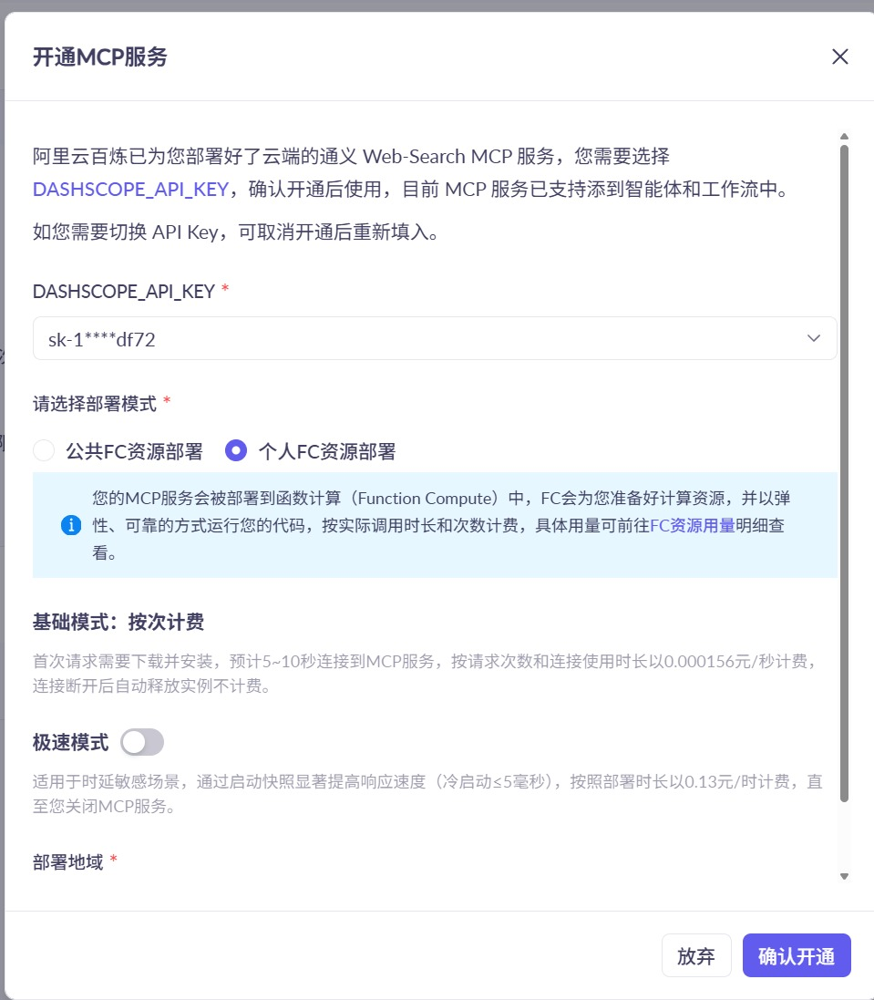

# 掌柜智库项目(RAG)实战

## 9. 检索数据节点实现与测试

### 9.4 网络搜索文档 (node_web_search_mcp)

**文件**: `app/query_process/agent/nodes/node_web_search_mcp.py`

#### 9.4.1 mcp的调用的准备工作

MCP 服务需先在阿里云百炼平台完成开通与配置，才能通过代码调用，以下是完整的开通流程说明：

**步骤1：前提条件**

已注册阿里云账号，并完成实名认证（百炼 MCP 服务需实名认证后使用）。

**步骤2：开通百炼 MCP 服务的详细步骤**

1、进入百炼 MCP 广场

打开浏览器，访问百炼 MCP 服务市场链接：

[https://bailian.console.aliyun.com/cn-beijing/?spm=a2c4g.11186623.0.0.5f885389KrrOsZ&tab=mcp#/mcp-market](#/mcp-market)

（若链接失效，可通过阿里云官网→“产品”→“人工智能”→“百炼”→“MCP 广场” 进入）

2、搜索并选择目标 MCP 服务

​	在 MCP 广场的搜索框中输入关键词（如 “联网搜索”）；

​	在搜索结果中找到目标服务（如本场景的 “联网搜索”），点击服务卡片进入详情页。


**步骤 3：开通 MCP 服务**

进入服务详情页后，点击 “开通服务” 按钮，会弹出 “开通 MCP 服务” 配置窗口，需完成以下配置：



1. **选择 API Key**：从下拉框中选择已有的`DASHSCOPE_API_KEY`（若未创建，需先在百炼控制台的 “API 密钥管理” 中生成）；
2. 选择部署模式：
   - 推荐选择「个人 FC 资源部署」（资源独立、安全隔离，适合正式场景）；
   - 测试场景可选择「公共 FC 资源部署」（共享资源，启动更快）；
3. 选择计费模式（个人FC资源部署）：
   - 「基础模式」：按调用时长计费（0.000156 元 / 秒），调用后释放资源，成本低；
   - 「极速模式」：按部署时长计费（0.13 元 / 时），启动速度极快（冷启动≤5 毫秒），适合低延迟场景；
4. **选择部署地域**：建议选择与业务服务器同地域（如 “华东 2（上海）”），降低网络延迟；
5. 确认配置后，点击 “确认开通” 按钮，等待百炼平台完成服务部署（通常 1-2 分钟）。

**步骤 4：获取 MCP 服务地址**

开通完成后，在服务详情页的 “调用信息” 区域，复制对应的**MCP 服务 SSE 地址**（如本场景的`https://dashscope.aliyuncs.com/api/v1/mcps/WebSearch/sse`），后续代码中需将该地址配置到`.env`文件的`MCP_DASHSCOPE_BASE_URL`中。

**注意事项**

1.  现在开通阿里百炼的bailian_web_search，如果是新申请的则默认是streamablehttp，不再支持sse。
2.  如果是之前开通的sse模式需要重新开通一下，会自动变为streamablehttp。
3.  百炼官方mcp 链接：https://bailian.console.aliyun.com/cn-beijing?spm=a2c4g.11186623.0.0.406e358bUXaXLy&tab=app#/mcp-market/detail/WebSearch

#### 9.4.2 处理策略

**1) 获取查询词**

从 LangGraph 全局状态对象`state`中提取**重写后的精准查询语句**（`rewritten_query`），为标准化搜索关键词；若该字段为空 / 未提取到，直接终止后续流程，避免无效 MCP 调用。

**2) 初始化 MCP 连接**

基于`MCPServerSse`创建 MCP 客户端实例，配置百炼 MCP 核心连接参数后，通过`await search_mcp.connect()`建立 SSE 流式连接（连接成功返回`{"type": "connect", "success": true}`）。

核心配置参数（JSON 格式）：

```json
{
  "url": "百炼MCP SSE接口地址（.env中MCP_DASHSCOPE_BASE_URL）",
  "headers": {
    "Authorization": "百炼/阿里云API密钥（.env中OPENAI_API_KEY）"
  },
  "timeout": 300,  // 客户端整体超时时间（秒）
  "sse_read_timeout": 300  // SSE流式读取超时时间（秒）
}
```

**3) 调用搜索工具**

基于已建立的 MCP 连接，通过`call_tool()`调用百炼专属搜索工具`bailian_web_search`，**工具调用固定传参格式（JSON）**，参数不可随意修改：

```
{
  "tool_name": "bailian_web_search",  // 固定值，百炼搜索工具唯一标识
  "arguments": {
    "query": "步骤1提取的rewritten_query",  // 必选，搜索查询词
    "count": 5  // 可选，返回结果数量，默认5条（建议1-10）
  }
}
```

**4) 解析与格式化**

接收 MCP 流式响应，提取有效数据并清洗，最终封装为统一格式文档列表，为后续节点提供标准化数据。

① MCP 原始返回值（核心有效片段，SSE 流式 JSON）

```json
{
  "type": "tool_call",
  "content": [
    {
      "text": "{\"pages\": [{\"title\": \"结果标题\", \"url\": \"结果链接\", \"snippet\": \"核心摘要\", \"source\": \"数据源\"}]}"
    }
  ]
}
```

② 解析规则

1. 过滤出`type: "tool_call"`的响应，提取`content[0].text`并转为 JSON 对象；
2. 提取对象中`pages`数组，遍历后仅保留`title`/`url`/`snippet`三个核心字段；
3. 对所有字段做清洗（去首尾空格、过滤空值），剔除`snippet`为空的无效结果。

③ 最终格式化结果（列表嵌套字典，统一格式）

```json
[
  {
    "title": "清洗后的结果标题",
    "url": "清洗后的结果链接",
    "snippet": "清洗后的核心摘要（非空）"
  }
]
```

**5) 更新状态与资源清理**

① 资源清理

无论调用成功 / 失败 / 中断，均通过`await search_mcp.cleanup()`关闭 MCP 连接，释放客户端资源，避免资源泄漏。

② 状态更新返回

将步骤 4 格式化后的文档列表，以`web_search_docs`为字段名更新到 LangGraph 全局状态并返回，供后续节点（重排序、大模型生成）使用；无有效结果则返回空字典。

最终返回状态（JSON）

```json
{
  "web_search_docs": [
    {
      "title": "HAK 180 烫金机官方操作手册",
      "url": "https://xxx.com/hak180/manual",
      "snippet": "HAK 180 顶部50-170mm局部烫金设置：操作面板【转印参数】-【区域设置】，选择顶部局部，输入起始50mm、结束170mm，保存生效"
    }
  ]
}
```

#### 9.4.3 处理关键点

OpenAI MCP 官方 SDK 的核心方法（`connect()`、`call_tool()`、`cleanup()`等）均为**异步函数（async def）**，而本项目中使用的 LangGraph 框架，其节点函数默认采用**同步调用方式（invoke）**。

由于 Python 语法限制，**同步函数中无法直接调用异步方法**（会抛出`SyntaxError`异常），因此需要让 LangGraph 的搜索节点（`node_web_search_mcp`）以同步方式运行 MCP 的异步 API，核心解决方案是使用`asyncio.run()`做**同步 - 异步桥接**：通过该方法临时启动一个异步事件循环，执行 MCP 的所有异步代码，执行完成后自动关闭循环，回到同步逻辑，这是 Python 中同步代码调用异步代码的标准方案。 

#### 9.4.4 代码实现

##### 步骤1： 准备和环境

需安装百炼 MCP 官方 SDK 和 Python 异步相关依赖，执行以下命令：

```cmd
# 核心依赖：MCPSDK（openai-agents）
uv add openai-agents
# 其他基础依赖（若未安装）：langgraph、requests、python-dotenv
uv add langgraph requests python-dotenv
```

配置文件和加载

环境变量配置（.env 文件）

在项目根目录创建`.env`文件，添加以下配置（替换为自身的百炼 API 密钥）：

```ini
# 百炼MCP WebSearch的SSE接口地址（固定值，无需修改）
MCP_DASHSCOPE_BASE_URL=https://dashscope.aliyuncs.com/api/v1/mcps/WebSearch/sse
MCP_DASHSCOPE_BASE_URL_STREAMABLE=https://dashscope.aliyuncs.com/api/v1/mcps/WebSearch/mcp
# 你的阿里云/百炼平台API密钥（从百炼控制台获取，必填）
OPENAI_API_KEY=sk-48849600c0fa4aa7bfd709e1f47415ff
```

定义读取配置文件

位置：`app/config/bailian_mcp_config.py`

```python
# 导入核心依赖：数据类、环境变量读取、路径处理
from dataclasses import dataclass
import os
from dotenv import load_dotenv

load_dotenv()


# 定义mcp的服务配置
@dataclass
class McpConfig:
    mcp_base_url: str
    api_key : str

mcp_config = McpConfig(
    mcp_base_url=os.getenv("MCP_DASHSCOPE_BASE_URL_STREAMABLE"),
    api_key=os.getenv("OPENAI_API_KEY")
)
```

##### 步骤2：导入基础依赖

```python
import asyncio
import os
import json
import sys
from agents.mcp import MCPServerSse # pip install openai-agents
from agents.mcp import MCPServerStreamableHttp # pip install openai-agents

from app.conf.bailian_mcp_config import mcp_config
from app.utils.task_utils import add_running_task,add_done_task

DASHSCOPE_BASE_URL_SSE = mcp_config.mcp_base_url
DASHSCOPE_API_KEY = mcp_config.api_key
```

MCP三种方式对比:

- stdio
  
  - 连接形态：本地进程间通信（你的客户端拉起 MCP Server 子进程，用 stdin/stdout 传 JSON-RPC）
  - 适用场景：本机工具、桌面插件、开发调试
  - 优点：实现简单、延迟低、不走网络、部署门槛低
  - 缺点：不适合跨机器/云原生；进程生命周期管理复杂；扩展性一般
- SSE
  
  - 连接形态：HTTP 下行流（Server → Client 推送事件）+ 通常再配一个上行请求通道
  - 适用场景：早期 Web 场景、需要流式返回但交互不复杂
  - 优点：浏览器友好、流式输出直观
  - 缺点：天然“偏单向”；上行/下行分离，协议拼装复杂；代理/网关兼容性、重连语义、会话一致性处理麻烦
- Streamable HTTP
  
  - 连接形态：基于 HTTP 的统一可流式传输模式（请求/响应语义更完整，可流式返回）
  - 适用场景：云上 MCP、跨网络调用、生产系统
  - 优点：更标准化、易被网关/CDN/鉴权体系接纳；与现代 API 基础设施更兼容；实现与运维一致性更好
  - 缺点：比 stdio 多网络链路与超时治理成本
  为什么很多场景从 SSE 转到 Streamable

- 本地工具/离线插件：选 stdio
- 浏览器演示/轻量流式：可用 SSE
- 云上生产、跨网络、要稳定：优先 Streamable HTTP

##### 步骤3：定义mcp网络访问工具

https://openai.github.io/openai-agents-python/mcp/

```python
async def mcp_call(query):
    # 初始化 MCP
    search_mcp = MCPServerSse(
        name="search_mcp",
        params={
            "url": DASHSCOPE_BASE_URL_SSE,
            "headers": {"Authorization": DASHSCOPE_API_KEY},
            "timeout": 300,
            "sse_read_timeout": 300
        }
    )

    try:
        await search_mcp.connect()
        # 直接调用工具
        result = await search_mcp.call_tool(
            tool_name="bailian_web_search",
            arguments={"query": query, "count": 5}
            # arguments={"query": "今天北京的天气情况", "count": 5}
        )
        return result
    finally:
        await search_mcp.cleanup()

async def mcp_call_streamable(query):
    search_mcp = MCPServerStreamableHttp(
        name="search_mcp",
        params={
            "url": DASHSCOPE_BASE_URL_STREAMABLE,
            "headers": {"Authorization": DASHSCOPE_API_KEY},
            "timeout": 300,
            "sse_read_timeout": 300,
            "terminate_on_close": True,
        },
        max_retry_attempts=2,
    )
    try:
        await search_mcp.connect()
        result = await search_mcp.call_tool(
            tool_name="bailian_web_search",
            arguments={"query": query, "count": 5},
        )
        return result
    finally:
        await search_mcp.cleanup()
```

另外了解：

- MCPServerStreamableHttp 是 Agents SDK 里的 MCP 连接器，负责连 streamable-http 的 MCP Server。
- MCP Adapter 是“翻译层”，把 MCP 暴露的 tools 转成 LangChain 可调用对象。

mcpadapter使用伪代码：

```python
import asyncio
from langchain.agents import create_agent
from langchain.chat_models import init_chat_model
from langchain_mcp_adapters.client import MultiServerMCPClient

DASHSCOPE_BASE_URL_STREAMABLE = "https://dashscope.aliyuncs.com/api/v1/mcps/WebSearch/sse"
DASHSCOPE_API_KEY = "Bearer <YOUR_API_KEY>"

async def run_with_mcp_agent(query: str):
    async with MultiServerMCPClient(
        {
            "search_mcp": {
                "transport": "streamable_http",
                "url": DASHSCOPE_BASE_URL_STREAMABLE,
                "headers": {"Authorization": DASHSCOPE_API_KEY},
                "timeout": 300,
                "sse_read_timeout": 300,
            }
        }
    ) as mcp_client:
        tools = await mcp_client.get_tools()

        model = init_chat_model(
            "qwen-plus",
            model_provider="openai",
            base_url="https://dashscope.aliyuncs.com/compatible-mode/v1",
            api_key="<YOUR_API_KEY>",
        )

        agent = create_agent(model=model, tools=tools)

        result = await agent.ainvoke(
            {"messages": [{"role": "user", "content": query}]}
        )
        return result

if __name__ == "__main__":
    out = asyncio.run(run_with_mcp_agent("帮我搜索今天AI行业三条新闻并总结"))
    print(out)
```

##### 步骤4：主流程编写

```python
def node_web_search_mcp(state):
    print("---node_web_search_mcp处理---")
    add_running_task(state["session_id"], sys._getframe().f_code.co_name, state.get("is_stream"))

    query = state.get("rewritten_query", "")
    docs = []
    # 如果没有查询内容，直接返回
    if query:
        result = asyncio.run(mcp_call_streamable(query))
        if result:
            pages = json.loads(result.content[0].text).get("pages") or []
            # 统一输出结构化结果，供后续 rerank/引用使用
            # 每条：{title, url, snippet}

            for item in pages:
                snippet = (item.get("snippet") or "").strip()
                url = (item.get("url") or "").strip()
                title = (item.get("title") or "").strip()
                if not snippet:
                    continue
                docs.append({"title": title, "url": url, "snippet": snippet})

            print("MCP 搜索结果:", docs)
    add_done_task(state["session_id"], sys._getframe().f_code.co_name, state.get("is_stream"))
    if docs:
        return {"web_search_docs": docs}
    return {}
```

#### 9.4.5 主流程测试

```python
from dotenv import load_dotenv

if __name__ == '__main__':
    load_dotenv()
    test_state = {
        "rewritten_query": "HAK 180 在出厂默认状态下，若想在纸张上只把烫金膜转印到顶部 50 mm–170 mm 的局部区域，应在操作面板上如何设置"
    }

    # 调用 websearch_node 函数
    result_state = node_web_search_mcp(test_state)

    # 验证结果
    print("测试结果:")
    print(f"查询内容: {test_state.get('rewritten_query')}")

    # 输出搜索结果
    search_results = result_state.get('web_search_docs', [])
    print(f"搜索结果数量: {len(search_results)}")
    print("search_results", search_results)
```

